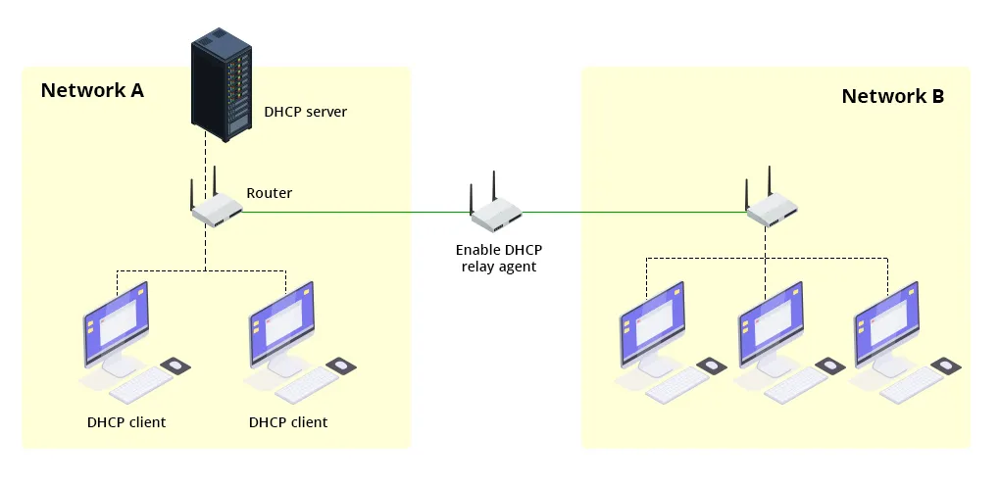

# DHCP




DHCP (Dynamic Host Configuration Protocol) es un protocolo de red utilizado para asignar automáticamente direcciones IP y otros parámetros de configuración de red a dispositivos en una red. Esto simplifica la gestión de las configuraciones de red, permitiendo que los dispositivos se conecten y se configuren sin intervención manual. Un servidor DHCP responde a las solicitudes de los clientes proporcionándoles una dirección IP, una máscara de subred, la puerta de enlace predeterminada y las direcciones de los servidores DNS. Esto es crucial para la administración eficiente de redes grandes, reduciendo errores de configuración y facilitando la movilidad de los dispositivos. DHCP es fundamental en redes tanto domésticas como empresariales, asegurando una conectividad fluida y automática.

[Inicio de sección](#dhcp) &nbsp; &nbsp; - &nbsp; &nbsp; [Índice](#índice)
<br><br>

# Índice
- [DHCP](#dhcp)
- [Índice](#índice)
- [Instalación](#instalación)
   

[<< Página principal >>](../../README.md)<br>
[Índice](#índice) &nbsp; &nbsp; - &nbsp; &nbsp;[Arriba](#ssh)
<br><br>

# Instalación

1. Verificar si dhcpcd está instalado:
    ```bash
    dpkg -l | grep dhcpcd
    ```
2. Si dhcpcd no está instalado, instálalo:
    ```bash
    sudo apt update
    sudo apt install dhcpcd5
    ```
3. Habilitar y empezar el servicio `dhcpcd`:
    ```bash
    sudo systemctl enable dhcpcd
    sudo systemctl start dhcpcd
    ```
4. Después de habilitar y empezar el servicio, verifica su estado:
    ```bash
    service dhcpcd status
    ```


[Inicio de sección](#instalación) &nbsp; &nbsp; - &nbsp; &nbsp; [Índice](#índice) &nbsp; &nbsp; - &nbsp; &nbsp;[Arriba](#header)
<br><br>