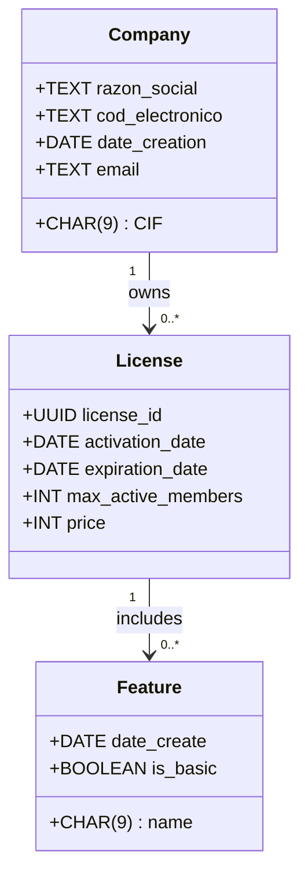
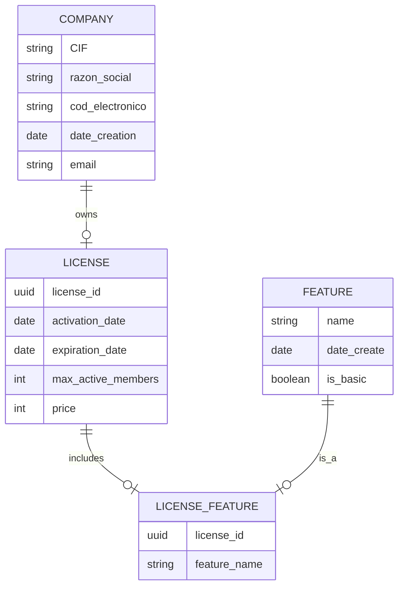

¡Claro! Vamos a organizar la documentación de tu sistema de licencias de una manera estructurada para que tengas una guía clara. Empezaré por las secciones que mencionas y te proporcionaré ejemplos para cada archivo que necesitas.

### **1. `index.md`**
Este es el archivo principal de la documentación. Debe ofrecer una visión general del proyecto, su propósito, y proporcionar enlaces a las demás secciones.

```markdown
# License Manager - Generador y Gestor de Licencias

Este sistema tiene como objetivo la **generación**, **renovación** y **gestión** de licencias para un software. Permite crear licencias con información cifrada y protegida mediante clave pública/privada, gestionar empresas asociadas y controlar el acceso a las funcionalidades de la aplicación a través de una base de datos SQLite.

## Estructura de la Documentación

- [Actores](actores.md)
- [Diagramas](diagramas/diagrama_clases.md)  
- [Epics](epic/EP-000-example.md)  
- [Historias Técnicas](ht/HT-000-example.md)  
- [Historias de Usuario](hu/HU-000-example.md)  
- [Test Manual](test-manual/test-hu000-example.md)  
```

---

### **2. `actores.md`**
Define los actores del sistema. En tu caso, es bastante sencillo, ya que solo eres tú quien lo usará, pero aún así es importante documentarlo.

```markdown
# Actores del Sistema

## Administrador

El administrador del sistema (en este caso, el propietario del software) tiene acceso completo a todas las funcionalidades del sistema de licencias. Sus principales responsabilidades son:

- **Generar licencias**: Crear nuevas licencias para empresas.
- **Gestionar licencias**: Ver y modificar licencias existentes.
- **Renovar licencias**: Modificar la fecha de expiración y otros parámetros de una licencia.
- **Gestionar empresas**: Añadir, editar o eliminar empresas asociadas a una licencia.

## Sistema de Licencias

El sistema actúa de manera autónoma, generando y verificando las licencias de acuerdo con las acciones del administrador.
```

---

### **3. Diagramas**
Dentro de la carpeta `diagramas`, tenemos dos archivos clave para estructurar el sistema:

#### **`diagrama_clases.md`**
Aquí puedes incluir un diagrama UML de clases que represente las entidades clave como `Licencia`, `Empresa`, `Características`, etc.

```markdown
# Diagrama de Clases


#### **`diagrama_er.md`**
En este archivo puedes detallar el modelo de la base de datos.

```markdown
# Diagrama Entidad-Relación



---

### **4. `epic/EP-000-example.md`**
Las épicas son grandes bloques de funcionalidad. Aquí tienes un ejemplo de una épica general para gestionar licencias.

```markdown
# EP-000 - Gestión de Licencias

## Descripción
Esta épica abarca todas las funcionalidades relacionadas con la creación, renovación, eliminación y gestión de licencias. Los usuarios deben poder generar nuevas licencias, renovarlas y asociarlas a empresas.

## Funcionalidades
- **Generación de licencias**: Crear licencias nuevas para empresas.
- **Renovación de licencias**: Modificar fechas de expiración y parámetros de licencias existentes.
- **Revocación de licencias**: Eliminar licencias que ya no son válidas.
```

---

### **5. `ht/HT-000-example.md`**
Historias técnicas que describen los aspectos técnicos de la implementación, como la encriptación de los datos.

```markdown
# HT-000 - Encriptación y Desencriptación de Licencias

## Descripción
La información de la licencia debe ser cifrada antes de ser almacenada. Usaremos un sistema de clave pública y privada para asegurar la protección de los datos.

## Requisitos Técnicos
- **Algoritmo**: RSA o AES para encriptación.
- **Formato de Datos**: Los datos deben ser almacenados en formato JSON.
- **Proceso de Encriptación**:
    - Generar un JSON con los detalles de la licencia.
    - Encriptar el JSON usando la clave pública del administrador.
    - Almacenar el JSON encriptado en la base de datos.

## Criterios de Aceptación
- El sistema debe ser capaz de cifrar y descifrar correctamente los datos usando claves públicas y privadas.
```

---

### **6. `hu/HU-000-example.md`**
Una historia de usuario que explica cómo se interactúa con el sistema desde la perspectiva de un administrador.

```markdown
# HU-000 - Generación de Licencia

## Como
Administrador del sistema de licencias,

## Quiero
Generar una nueva licencia para una empresa,

## Para
Que la empresa pueda acceder a las funcionalidades de mi software.

### Criterios de Aceptación
- El sistema debe permitir ingresar la información de la empresa.
- El sistema debe generar un ID único para la licencia.
- La licencia debe ser almacenada de manera encriptada en la base de datos.
```

---

### **7. `test-manual/test-hu000-example.md`**
Aquí documentas cómo se deben realizar las pruebas manuales para la historia de usuario.

```markdown
# Test HU-000 - Generación de Licencia

## Descripción
Prueba manual de la generación de una nueva licencia.

### Pasos:
1. Inicia el sistema y accede como administrador.
2. Selecciona "Generar nueva licencia".
3. Ingresa la información de la empresa (CIF, nombre, etc.).
4. Haz clic en "Generar licencia".
5. Verifica que el sistema muestre un mensaje de éxito y que la nueva licencia esté registrada en la base de datos.

### Criterios de Éxito
- La licencia es generada y almacenada correctamente.
- Los datos son visibles en la interfaz del administrador.
```

---

Con esta estructura, tendrás la documentación organizada y clara para tu proyecto. Si necesitas más detalles o alguna otra sección, no dudes en decirme.