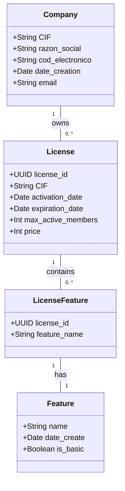
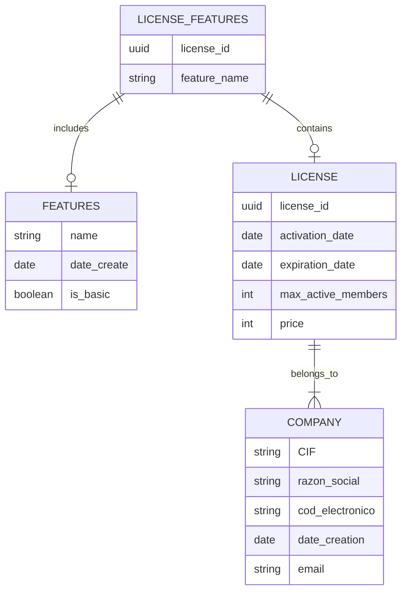

Aquí tienes un esquema de cómo podrías estructurar la documentación de tu sistema de gestión de licencias, con ejemplos de contenido para cada archivo. Esta documentación está pensada para proporcionarte un punto de partida y puedes expandirla o ajustarla conforme avances en el desarrollo del software.

---

### **./docs/proyectos/license_manager/index.md**

```markdown
# License Manager

El **License Manager** es una aplicación de escritorio desarrollada en Python que permite generar, renovar y gestionar licencias para otro software. Utiliza una base de datos SQLite para almacenar la información sobre las licencias, las empresas, y las funcionalidades habilitadas en cada licencia.

## Descripción General

Este software permite crear licencias personalizadas, asociarlas a una empresa y generar un archivo JSON encriptado con la información de la licencia. Las licencias contienen información como la fecha de activación, expiración, y las funcionalidades disponibles. También están protegidas mediante un sistema de encriptación con clave pública y clave privada.

## Estructura de Carpetas

La estructura del proyecto es la siguiente:

```
./docs/proyectos/license_manager/
├── actores.md
├── diagramas
│   ├── diagrama_clases.md
│   └── diagrama_er.md
├── epic
│   └── EP-000-example.md
├── ht
│   └── HT-000-example.md
├── hu
│   └── HU-000-example.md
├── img
├── index.md
├── secciones.md
└── test-manual
    └── test-hu000-example.md
```
```

---

### **./docs/proyectos/license_manager/actores.md**

```markdown
# Actores del Sistema

El sistema tiene los siguientes actores principales:

1. **Administrador**
   - **Responsabilidad**: Generar, renovar y gestionar licencias. Configurar los parámetros de las licencias, como las funcionalidades habilitadas, fechas de activación y expiración.
   - **Interacciones**: Interactúa con la aplicación de escritorio a través de una interfaz gráfica para crear, editar y verificar las licencias.

2. **Sistema**
   - **Responsabilidad**: Encriptar y desencriptar las licencias utilizando el sistema de clave pública y clave privada. Verificar las licencias mediante validaciones de fecha y características.
   - **Interacciones**: Ejecuta los procesos de encriptación y validación de licencias.

3. **Cliente/Empresa**
   - **Responsabilidad**: Usar las licencias generadas por el administrador para acceder al software. Recibe la licencia en formato JSON y la utiliza para acceder a las funcionalidades habilitadas.
   - **Interacciones**: Recibe el archivo de licencia, lo desencripta y accede a las características asociadas a su licencia.
```

---

### **./docs/proyectos/license_manager/diagramas/diagrama_clases.md**

```markdown
# Diagrama de Clases

A continuación se muestra un diagrama de clases del sistema. El diagrama describe las principales entidades involucradas en la gestión de licencias y su interacción:

```

```

---

### **./docs/proyectos/license_manager/diagramas/diagrama_er.md**

```markdown
# Diagrama Entidad-Relación (ER)

El diagrama siguiente describe la estructura de la base de datos SQLite que almacena la información de las licencias, las empresas y las características asociadas:

```

```

---

### **./docs/proyectos/license_manager/epic/EP-000-example.md**

```markdown
# EP-000 - Gestión de Licencias

## Descripción
Como administrador del software, quiero poder generar, renovar y gestionar licencias, para controlar el acceso y uso del software por parte de los clientes.

## Objetivos
- Generar licencias con fecha de activación y expiración.
- Asignar funcionalidades específicas a cada licencia.
- Encriptar la información de la licencia para seguridad.

## Módulos
- Generación de licencias.
- Renovación de licencias.
- Almacenamiento y encriptación de datos.
```

---

### **./docs/proyectos/license_manager/ht/HT-000-example.md**

```markdown
# HT-000 - Generación de Licencias

## Descripción
Se deberá implementar un proceso en la aplicación para generar licencias que incluyan la información de la empresa, los detalles de la licencia y las características habilitadas.

### Criterios de Aceptación
- La licencia se genera con un ID único.
- La fecha de activación y expiración son configurables.
- Se debe permitir seleccionar las funcionalidades habilitadas para la licencia.
- La licencia generada debe ser encriptada y almacenada en un archivo JSON.

### Pruebas
1. Verificar que la licencia generada tenga un ID único.
2. Verificar que la fecha de activación y expiración sean correctas.
3. Verificar que las funcionalidades seleccionadas se incluyan en el archivo JSON.
```

---

### **./docs/proyectos/license_manager/hu/HU-000-example.md**

```markdown
# HU-000 - Generación de Licencias

## Como
Administrador del sistema

## Quiero
Poder generar una licencia para una empresa con fecha de activación y expiración, y asignar funcionalidades específicas.

## Para
Controlar el acceso a los servicios del software según las licencias vendidas.

### Criterios de Aceptación
- La licencia debe tener un ID único.
- La fecha de activación y expiración deben ser configurables.
- La licencia debe contener las funcionalidades habilitadas en formato JSON.
```

---

### **./docs/proyectos/license_manager/test-manual/test-hu000-example.md**

```markdown
# Test HU-000 - Generación de Licencias

## Descripción
Pruebas manuales para verificar que el proceso de generación de licencias funcione correctamente.

### Pasos para realizar el test
1. Iniciar la aplicación y acceder como administrador.
2. Seleccionar una empresa de la base de datos o crear una nueva.
3. Ingresar la fecha de activación y expiración.
4. Seleccionar las funcionalidades habilitadas para la licencia.
5. Generar la licencia y verificar que se guarde en el formato JSON.

### Resultados Esperados
- La licencia generada tiene un ID único.
- La fecha de activación y expiración son correctas.
- El archivo JSON contiene las funcionalidades correctas y está encriptado.

### Pruebas adicionales
1. Intentar generar una licencia sin completar todos los campos.
2. Verificar que la licencia se almacene correctamente en la base de datos.
```

---

Con esta estructura, tienes una base sólida para empezar a documentar el desarrollo de tu sistema de gestión de licencias. Puedes adaptar y expandir cada sección conforme avances en el desarrollo. Si necesitas detalles adicionales o alguna ayuda en específico con algún archivo, no dudes en preguntar.