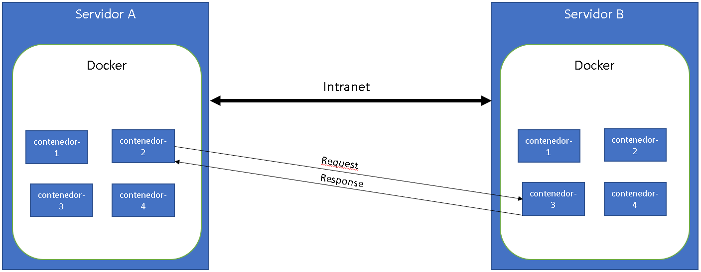

---
authors:
  - Carmelo Molero Castillo
date: 2025-03-19
---

# Redes en Docker



Las redes en Docker permiten la comunicación entre contenedores y entre los contenedores y el host. Proporcionan un entorno flexible para conectar servicios y gestionar su interacción de manera segura y eficiente.

Las redes en Docker son esenciales para la conectividad en entornos de contenedores, facilitando la comunicación y el aislamiento de los servicios.

## ¿Por qué usar redes en Docker?

- **Interconexión de Contenedores:** Permiten que los contenedores se comuniquen entre sí sin exponer puertos adicionales en el host.
- **Aislamiento y Seguridad:** Cada red de Docker proporciona un entorno aislado para los contenedores, lo que mejora la seguridad y la segmentación del tráfico.
- **Configuración Flexible:** Docker ofrece distintos tipos de redes para adaptarse a diferentes necesidades de conectividad.

## **Tipos de Redes en Docker**

Docker proporciona varios tipos de redes para diferentes casos de uso, y la elección de la red adecuada depende de los requisitos de comunicación y aislamiento de tu aplicación. A continuación se detallan los diferentes tipos de redes, sus características y ejemplos de cómo se utilizan:

### 1. **Bridge (Predeterminada)**

**Descripción:**

- La red **Bridge** es la red por defecto que Docker crea para los contenedores.
- Es una red **isolada** en el host, que permite que los contenedores se comuniquen entre sí si están conectados a la misma red **Bridge**. Los contenedores pueden acceder a la red externa (Internet) a través del host Docker, pero los contenedores no pueden comunicarse directamente con contenedores en otros hosts sin configuraciones adicionales.
- Si no se especifica una red para un contenedor, Docker lo conecta automáticamente a la red **Bridge**.

**Características:**

- Los contenedores en la misma red **Bridge** pueden comunicarse entre sí.
- Los contenedores pueden acceder a la red externa (Internet) a través del host.
- Ideal para aplicaciones que no requieren una comunicación externa a través de otros hosts.

**Ejemplo:**

Supón que tienes dos contenedores ejecutando servicios diferentes (como una base de datos y una aplicación web) y quieres que se comuniquen entre sí pero no necesitas que se comuniquen fuera del host.

```bash
# Crear una red Bridge personalizada
docker network create --driver bridge mi_red

# Ejecutar contenedores conectados a esta red
docker run -d --name contenedor1 --network mi_red nginx
docker run -d --name contenedor2 --network mi_red mysql
```

En este ejemplo, ambos contenedores están conectados a la red **mi_red** (que es una variante de la red Bridge), por lo que pueden comunicarse entre sí. Sin embargo, no tienen acceso directo a la red externa.

### 2. **Host**

**Descripción:**

- La red **Host** elimina el aislamiento de red entre el contenedor y el host.
- Los contenedores que utilizan esta red comparten la pila de red del host directamente, lo que significa que usan las mismas IPs que el host, eliminando el contenedor como un "caja negra" aislada.
- Es útil cuando se necesitan recursos de red del host o si se desea eliminar la sobrecarga de virtualización de la red (como en redes de alto rendimiento).

**Características:**

- Los contenedores utilizan las direcciones IP del host directamente.
- No hay aislamiento de red entre contenedores y host.
- Ideal para aplicaciones que necesitan un alto rendimiento de red o tienen requerimientos específicos que deben coincidir con la red del host.

**Ejemplo:**

Si estás ejecutando una aplicación que necesita un rendimiento de red extremadamente alto o que tiene que estar directamente vinculada a la red del host, como un servidor de bases de datos en tiempo real:

```bash
# Ejecutar un contenedor usando la red host
docker run -d --name mi_contenedor --network host nginx
```

En este caso, el contenedor utilizará la misma IP que el host y se comportará como si fuera una aplicación directamente en el host.

### 3. **None**

**Descripción:**

- La red **None** deshabilita completamente la conectividad de red para el contenedor.
- No hay comunicación de red entre el contenedor y otros contenedores ni con el host.
- Es útil cuando se necesita ejecutar un contenedor en aislamiento completo de la red, tal vez para propósitos de pruebas o para ejecutar servicios que no requieran comunicación de red.

**Características:**

- El contenedor no tiene acceso a la red, ni interna ni externa.
- Ideal para contener servicios que no deben comunicarse con otros contenedores o con el exterior, como aplicaciones aisladas o contenedores de un solo propósito.

**Ejemplo:**

Si necesitas ejecutar un contenedor para almacenar datos sin necesidad de red (por ejemplo, en un proceso aislado que no requiere red):

```bash
# Ejecutar un contenedor con la red None
docker run -d --name contenedor_sin_red --network none nginx
```

Este contenedor no tendrá acceso a ninguna red ni interna ni externa.

### 4. **Overlay**

**Descripción:**

- La red **Overlay** permite la comunicación entre contenedores distribuidos en diferentes hosts de Docker. Esto se logra utilizando Docker Swarm o Docker Compose en modo de clúster.
- Esta red es ideal para aplicaciones distribuidas y microservicios que se ejecutan en múltiples máquinas físicas o virtuales, ya que permite que los contenedores se comuniquen entre sí a través de diferentes hosts en un clúster.
- Docker crea una red virtual que se extiende entre todos los nodos del clúster.

**Características:**

- Permite la comunicación entre contenedores distribuidos en diferentes hosts.
- Requiere que Docker Swarm o una configuración de clúster esté habilitado.
- Ideal para aplicaciones que deben escalar horizontalmente y necesitan que sus componentes se comuniquen entre diferentes máquinas.

**Ejemplo:**

Supongamos que tienes un clúster de Docker Swarm y quieres que los contenedores en diferentes nodos se comuniquen entre sí:

```bash
# Crear una red Overlay en Docker Swarm
docker network create --driver overlay mi_red_overlay

# Ejecutar contenedores en diferentes nodos, pero conectados a la misma red Overlay
docker service create --name servicio1 --replicas 3 --network mi_red_overlay nginx
```

Aquí, los contenedores pueden estar en diferentes nodos del clúster, pero todos estarán conectados a la red **mi_red_overlay**, permitiendo la comunicación entre ellos.

### 5. **Macvlan**

**Descripción:**
- La red **Macvlan** asigna direcciones MAC virtuales a los contenedores, lo que les permite actuar como dispositivos físicos independientes en la red física.
- Con **Macvlan**, los contenedores tienen su propia dirección MAC y se comportan como si estuvieran conectados directamente a la red física del host, lo que les da acceso a la red local o a una red externa sin tener que pasar por el host.

**Características:**
- Los contenedores tienen direcciones MAC únicas, lo que les permite aparecer como dispositivos físicos en la red.
- Ideal para cuando los contenedores necesitan estar directamente en la red física y no en una red virtualizada o aislada.
- Es útil para aplicaciones que necesitan interactuar con dispositivos físicos en la red, como en redes de almacenamiento o aplicaciones de red intensivas.

**Ejemplo:**
Si necesitas que tus contenedores se comporten como máquinas físicas en la red local (por ejemplo, para ser accesibles directamente desde otros dispositivos en la misma red física):
```bash
# Crear una red Macvlan
docker network create -d macvlan --subnet=192.168.1.0/24 --gateway=192.168.1.1 mi_red_macvlan

# Ejecutar un contenedor en la red Macvlan
docker run -d --name contenedor_macvlan --network mi_red_macvlan nginx
```
En este ejemplo, el contenedor `contenedor_macvlan` tendría una dirección IP de la subred `192.168.1.0/24` y sería accesible como cualquier otro dispositivo en la red física.

---

### **Resumen de Cuándo Utilizar Cada Tipo de Red:**

- **Bridge:** Ideal para aplicaciones que se ejecutan en un solo host y no necesitan conectividad externa. Es útil cuando quieres que los contenedores se comuniquen entre sí en el mismo host.
- **Host:** Útil cuando necesitas que los contenedores utilicen directamente la red del host, eliminando el aislamiento de red.
- **None:** Perfecto cuando quieres un contenedor completamente aislado de la red, sin comunicación con el host ni con otros contenedores.
- **Overlay:** Necesario cuando tienes contenedores distribuidos en diferentes hosts y quieres que se comuniquen entre sí, típicamente en un clúster de Docker Swarm.
- **Macvlan:** Utilizado cuando los contenedores necesitan actuar como dispositivos físicos en la red, con una dirección MAC única, ideal para redes locales y aplicaciones que requieren acceso directo a la red física.

---

## Gestión de Redes en Docker

### Crear una red
```bash
docker network create mi_red
```

### Listar redes existentes
```bash
docker network ls
```

### Inspeccionar una red
```bash
docker network inspect mi_red
```

### Conectar un contenedor a una red
```bash
docker network connect mi_red mi_contenedor
```

### Desconectar un contenedor de una red
```bash
docker network disconnect mi_red mi_contenedor
```

### Eliminar una red
```bash
docker network rm mi_red
```