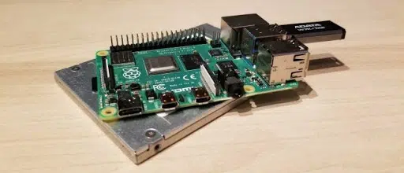
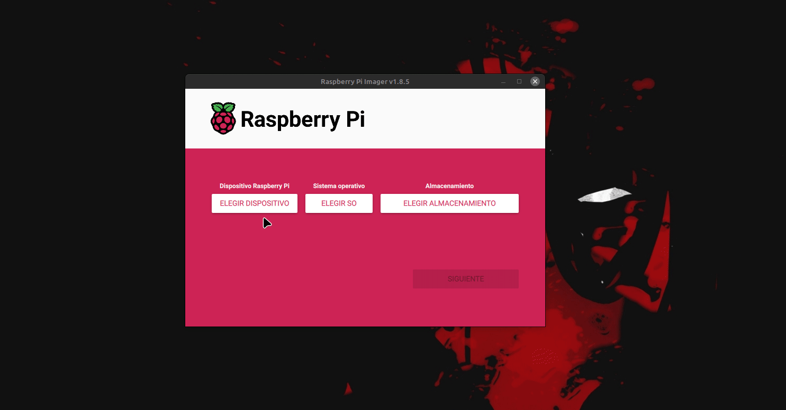
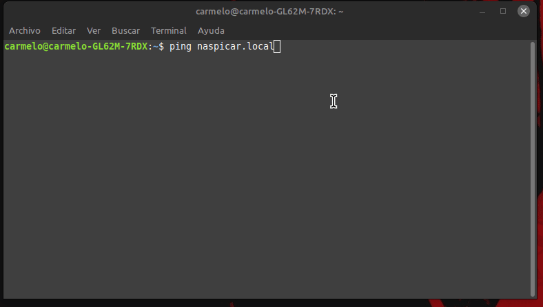

# Inicialización Básica de Raspberry Pi



**Descripción**:  
Guía detallada sobre los primeros pasos para configurar una Raspberry Pi, incluyendo la instalación de Raspbian Lite 64bit, Docker, Docker Compose y mhddfs.

**Características principales**:  
- ✅ **Instalación de Raspbian Lite 64bit** - Configuración inicial y acceso remoto por SSH.  
- ✅ **Configuración de red estática** - Asignación de IP manual usando `dhcpcd` o `systemd-networkd`.  
- ✅ **Instalación de paquetes esenciales** - Herramientas básicas para administración del sistema.  

---

## Instalación

### Requisitos previos
- 📌 **Hardware**: Raspberry Pi (cualquier modelo soportado) y una tarjeta microSD.  
- 📌 **Software**: Raspberry Pi Imager, cliente SSH (PuTTY o terminal de Linux/macOS).  
- 📌 **Conexión a Internet**: Cable Ethernet o Wi-Fi configurado previamente.  

### Instalación de Raspbian Lite 64bit

1. **Descargar el instalador "Raspberry Pi Imager"**:  
    Visita la [página oficial de Raspberry Pi](https://www.raspberrypi.com/software/) y descarga `Raspberry Pi Imager`.

2. **Grabar la imagen en una tarjeta SD**:  
    Sigue los pasos en el siguiente `gif` para preconfigurar la imagen con acceso SSH.  
    ```bash
    anfitrión: naspicar.local
    usuario: naspicar
    ```
   

3. **Primer arranque y conexión por SSH**:  
    Descubrir la IP de la Raspberry Pi:  
    ```bash
    $ ping naspicar.local
    ```  
      
    Conectar por SSH:  
    ```bash
    $ ssh naspicar@192.168.1.245
    ```

4. **Actualizar el sistema y paquetes esenciales**:  
    ```bash
    $ sudo apt-get -y update && sudo apt-get -y upgrade && sudo apt-get -y dist-upgrade
    $ sudo apt-get -y install vim neofetch cpufetch ranger htop tree
    $ sudo apt-get -y autoclean && sudo apt-get -y autoremove
   ```

---

## Configuración de red

### Asignar IP estática

#### Opción 1: `dhcpcd`
```bash
$ sudo vim /etc/dhcpcd.conf

# Configuración estática de IP
$ interface eth0
$ static ip_address=192.168.1.20/24
$ static routers=192.168.1.1
$ static domain_name_servers=192.168.1.10
```

#### Opción 2: `systemd-networkd`
```bash
$ sudo systemctl enable systemd-networkd
$ sudo systemctl start systemd-networkd

$ sudo vim /etc/systemd/network/10-eth0.network

---
[Match]
Name=eth0

[Network]
Address=192.168.1.10/24
Gateway=192.168.1.1
DNS=192.168.1.10
---
```

**Reiniciar para aplicar cambios**:  
```bash
$ sudo shutdown -r now
```

---

## Configuración con `raspi-config`
```bash
$ sudo raspi-config
```
Seleccionar las siguientes opciones:
```
1 System Option
  └── S5 Boot / Auto Login → B2 Console Autologin
5 Localisation Options
  ├── L1 Locale       → es_ES.UTF-8 UTF-8
  ├── L2 Timezone     → Europe / Madrid
  ├── L3 Keyboard
  └── L4 WLAN Country → ES Spain
6 Advanced Options
  └── A1 Expand Filesystem
8 Update
```

---

## Instalación de mhddfs

[En esta sección, aprenderás a instalar y configurar mhddfs en tu Raspberry Pi.](../../linux/sistemas-archivos/mhddfs/mhddfs.md)

---

## Solución de problemas

**Error 1: No se puede conectar por SSH**  
Solución: Verifica que SSH está habilitado:
```bash
$ sudo systemctl status ssh
```
Si está deshabilitado, actívalo:
```bash
$ sudo systemctl enable ssh
$ sudo systemctl start ssh
```

**Error 2: Problema con la IP estática**  
Solución: Verifica la configuración con:
```bash
$ ip addr
$ ip route show
```

**Error 3: Problemas con el arranque de `systemd-networkd`**  
Solución: Asegúrate de que el servicio está habilitado:
```bash
$ sudo systemctl status systemd-networkd
```