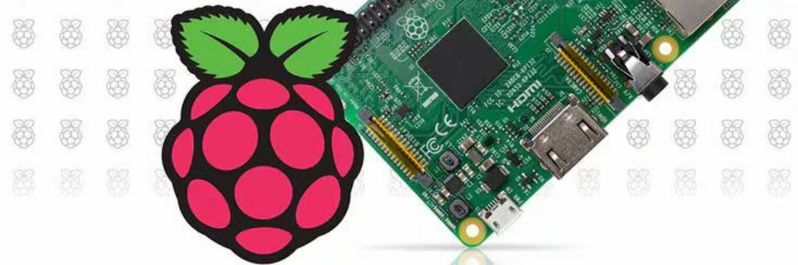

# Raspberry Pi



## Introducción
Raspberry Pi es una serie de computadoras de placa única (SBC) desarrolladas por la Raspberry Pi Foundation en el Reino Unido. Su bajo costo, consumo eficiente de energía y tamaño compacto las hacen ideales para una amplia gama de proyectos de electrónica y programación.

## Características Principales

- **Tamaño Pequeño:** Su tamaño similar al de una tarjeta de crédito la hace extremadamente compacta.
- **Bajo Costo:** Diseñada para fomentar la educación en informática a bajo costo.
- **Puertos y Conectividad:** Incluye USB, HDMI, Ethernet y GPIO, facilitando su integración en proyectos.
- **Flexibilidad:** Compatible con varios sistemas operativos como Raspbian, Ubuntu y versiones especializadas de Windows.

## Usos Comunes

- **Educación:** Utilizada ampliamente en escuelas para enseñar informática y programación.
- **Proyectos de Electrónica y Robótica:** Ideal para proyectos DIY, automatización del hogar y vigilancia.
- **Servidores y Aplicaciones Web:** Se emplea como servidor web o para alojar aplicaciones ligeras.
- **Media Center:** Con software como Kodi, se convierte en un centro multimedia.

## Configuración Personalizada de la Instalación
Para optimizar la funcionalidad, se configuraron dos equipos:

1. **Equipo 1:** Responsable de los servicios DNS y DHCP.
2. **Equipo 2:** Actúa como DNS secundario y aloja servicios adicionales como Plex y Samba.

### Equipo 1: Raspberry Pi 3 Model B Rev 1.2

#### Características del sistema
```bash
$ neofetch

  `.::///+:/-.        --///+//-:``    pi@raspberrypi 
 `+oooooooooooo:   `+oooooooooooo:    -------------- 
  /oooo++//ooooo:  ooooo+//+ooooo.    OS: Raspbian GNU/Linux 12 (bookworm) armv7l 
  `+ooooooo:-:oo-  +o+::/ooooooo:     Host: Raspberry Pi 3 Model B Rev 1.2 
   `:oooooooo+``    `.oooooooo+-      Kernel: 6.6.28+rpt-rpi-v7 
     `:++ooo/.        :+ooo+/.`       Uptime: xx hours 
        ...`  `.----.` ``..           Packages: yyy (dpkg) 
     .::::-``:::::::::.`-:::-`        Shell: bash 5.2.15 
    -:::-`   .:::::::-`  `-:::-       Terminal: /dev/pts/0 
   `::.  `.--.`  `` `.---.``.::`      CPU: BCM2835 (4) @ 1.200GHz 
       .::::::::`  -::::::::` `       Memory: 267MiB / 920MiB 
 .::` .:::::::::- `::::::::::``::.      
-:::` ::::::::::.  ::::::::::.`:::-   MicroSD: 8GB                        
::::  -::::::::.   `-::::::::  ::::                           
-::-   .-:::-.``....``.-::-.   -::-
 .. ``       .::::::::.     `..`..
   -:::-`   -::::::::::`  .:::::`
   :::::::` -::::::::::` :::::::.
   .:::::::  -::::::::. ::::::::
    `-:::::`   ..--.`   ::::::.
      `...`  `...--..`  `...`
            .::::::::::
             `.-::::-`
```

#### Respaldo y Mantenimiento
Se utiliza `pishrink` para optimizar el tamaño de la imagen de respaldo de la tarjeta MicroSD. Se puede apagar el sistema sin afectar la red gracias a la redundancia de DNS.

#### Software Instalado
- **Docker:** Permite la gestión de aplicaciones en contenedores. [`Configuración`](./utilidades/docker/docker.md).
- **PiHole:** Servidor DNS que bloquea anuncios y rastreadores. [`Configuración`](../self-hosting/pihole/pihole.md).

### Equipo 2: Raspberry Pi 4 Model B Rev 1.4

#### Características del sistema
```bash
$ neofetch

       _,met$$$$$gg.          naspicar@naspicar 
    ,g$$$$$$$$$$$$$$$P.       ----------------- 
  ,g$$P"     """Y$$.".        OS: Debian GNU/Linux 12 (bookworm) aarch64 
 ,$$P'              `$$$.     Host: Raspberry Pi 4 Model B Rev 1.4 
',$$P       ,ggs.     `$$b:   Kernel: 6.6.28+rpt-rpi-v8 
`d$$'     ,$P"'   .    $$$    Uptime: xxx mins 
 $$P      d$'     ,    $$P    Packages: yyy (dpkg) 
 $$:      $$.   -    ,d$$'    Shell: bash 5.2.15 
 $$;      Y$b._   _,d$P'      Terminal: /dev/pts/0 
 Y$$.    `.`"Y$$$$P"'         CPU: (4) @ 1.800GHz 
 `$$b      "-.__              Memory: 358MiB / 1846MiB
  `Y$$                        
   `Y$$.                      MicroSD: 32GB ó 64GB                        
     `$$b.                                            
       `Y$$b.
          `"Y$b._
              `"""
```
#### Respaldo y Mantenimiento
Al igual que el Equipo 1, se utiliza `pishrink` para generar una imagen optimizada de la MicroSD.

#### Software Instalado
- **Docker:** Permite la gestión de aplicaciones en contenedores. [`Configuración`](./utilidades/docker/docker.md).
- **Homarr:** Panel de inicio para gestionar aplicaciones web. [`Configuración`](../self-hosting/homarr/homarr.md).
- **Homebridge:** Integración con Apple HomeKit. [`Configuración`](../self-hosting/homebridge/homebridge.md).
- **PiHole:** Servidor DNS que bloquea anuncios y rastreadores. [`Configuración`](../self-hosting/pihole/pihole.md).
- **Plex:** Servidor multimedia. [`Configuración`](../self-hosting/plex/plex.md).
- **Portainer:** Gestión visual de contenedores Docker. [`Configuración`](../self-hosting/portainer/portainer.md).
- **Samba:** Compartición de archivos en red. [`Configuración`](../self-hosting/samba/samba.md).