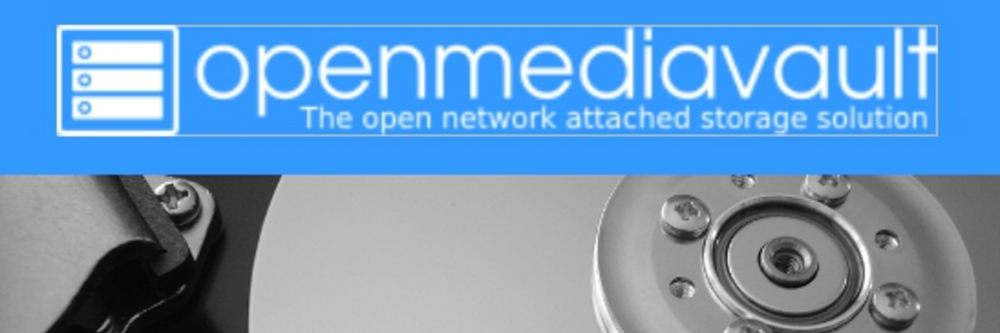

# OpenMediaVault



**Descripción**:  
OpenMediaVault (OMV) es un sistema operativo de red de código abierto basado en Debian, diseñado para gestionar y compartir archivos en una red doméstica o empresarial. Ofrece una interfaz web sencilla para administrar almacenamiento, compartir archivos y configurar servicios de red.

**Características principales**:  
- ✅ **Administración de Almacenamiento** - OMV permite gestionar discos, particiones y sistemas RAID desde una interfaz web intuitiva.  
- ✅ **Compartición de Archivos** - Facilita el acceso a archivos a través de SMB/CIFS, NFS, FTP, y WebDAV.  
- ✅ **Servicios de Red** - Incluye servicios como servidor DLNA/UPnP, servidor de impresión, y servidor BitTorrent.  

---

## Instalación

Antes de instalar OpenMediaVault en tu Raspberry Pi, asegúrate de cumplir con los **requisitos previos**:

### Requisitos previos
- 📌 **Sistema operativo compatible**: Raspberry Pi OS Lite (64-bit) o similar.
- 📌 **Dependencias**: Conexión a internet y hardware compatible.
- 📌 **Acceso**: Acceso a la terminal de la Raspberry Pi con permisos de administrador.

### Instalación en Raspberry Pi

Ejecuta los siguientes comandos en la terminal para instalar OMV:

```bash
# Actualizar el sistema
$ sudo apt-get update -y && sudo apt-get upgrade -y

# Preparar el sistema para OMV
$ wget -O - https://github.com/OpenMediaVault-Plugin-Developers/installScript/raw/master/preinstall | sudo bash
sudo reboot

# Instalar OMV
$ wget -O - https://github.com/OpenMediaVault-Plugin-Developers/installScript/raw/master/install | sudo bash
```

---

## Uso

Una vez instalado OpenMediaVault, accede a la interfaz web a través de un navegador:

```bash
http://<ip_raspberrypi>/#/login

# Las credenciales por defecto son:
    ## user: admin
    ## pass: openmediavault
```

### Pasos recomendados
1. **Cambiar la contraseña por defecto**: Ve a la parte superior derecha para cambiar la contraseña.
2. **Configurar una IP fija**: Configura la IP estática para que OMV tenga una dirección IP constante en la red.
3. **Habilitar los widgets de monitorización**: En el dashboard puedes ver información relevante sobre el sistema.
4. **Buscar actualizaciones**: Mantén OMV actualizado para asegurar el mejor rendimiento.

---

## Configuración

Una vez instalado, puedes configurar tu servidor NAS a través de la interfaz web de OpenMediaVault. Por ejemplo, configura una IP fija siguiendo estos pasos:

1. Accede a la interfaz web de OMV.
2. Ve a "Red" -> "Interfaces" -> "IPv4" y configura:
   - *Método*: Estático
   - *Dirección IP*: 192.168.1.20
   - *Máscara de subred*: 255.255.255.0
   - *Gateway*: 192.168.1.1
   - *DNS*: 8.8.8.8

---

## Solución de problemas

**Error 1: No puedo acceder a la interfaz web de OMV**  
Solución: Verifica que la Raspberry Pi esté correctamente conectada a la red y que la dirección IP sea correcta.

**Error 2: El sistema no arranca**  
Solución: Revisa los logs del sistema para identificar posibles errores de instalación.

💡 *Si el proyecto tiene una sección de Preguntas Frecuentes (FAQ), inclúyela aquí*.

---

## Añadir HDDs

Para conectar y gestionar discos duros en OpenMediaVault usando la Raspberry Pi, asegúrate de tener un HUB USB adecuado. Considera utilizar **mhddfs** para gestionar discos múltiples si planeas conectar más de un HDD. Consulta la [guía para conectar HDD's](../utilidades/pi-hdd/pi-hdd.md) para más detalles.