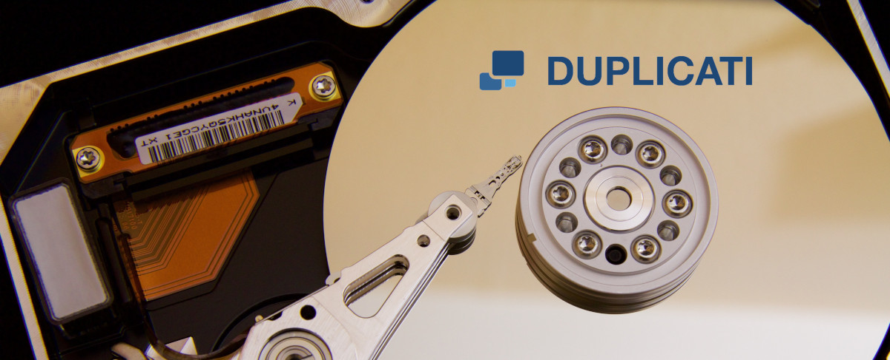

# Duplicati



**Duplicati** es un software de **copia de seguridad (backup)** gratuito y de código abierto que permite hacer **respaldos cifrados y comprimidos** en diversas ubicaciones, incluyendo:  

✅ **Nube** (Google Drive, Dropbox, OneDrive, Amazon S3, etc.)  
✅ **Servidores remotos** (via FTP, WebDAV, SSH/SFTP)  
✅ **Unidades locales y externas** (discos duros, USB, NAS, etc.)  

### **Características principales**  
🔹 **Cifrado AES-256** para proteger los datos.  
🔹 **Compresión** para ahorrar espacio.  
🔹 **Copias de seguridad incrementales** (solo guarda los cambios).  
🔹 **Programación automática** de backups.  
🔹 **Interfaz web accesible desde cualquier navegador**.  
🔹 **Restauración de archivos individuales o versiones anteriores**.  
🔹 **Compatibilidad con Windows, Linux y macOS**.  

### **¿Para qué se usa?**  
🔹 Hacer **copias de seguridad automatizadas** de documentos, fotos o servidores.  
🔹 Guardar backups en la nube sin depender de soluciones de pago.  
🔹 Proteger datos personales o empresariales con **cifrado fuerte**.  
🔹 Restaurar archivos de versiones anteriores en caso de eliminación o corrupción.  

### **Ejemplo de uso**  
Si tienes un servidor y quieres hacer un backup a **Google Drive**, puedes configurarlo en Duplicati para que suba copias de seguridad cada noche de manera automática y cifrada.    

Es una excelente opción **gratuita** si buscas un sistema de backup seguro y fácil de usar.

🔹 **Página oficial**: [https://www.duplicati.com](https://www.duplicati.com)

---

## Instalación

Todos los ficheros relacionados con nuestra instalación de **Duplicati** se alojarán dentro de un directorio ubicado en `~/docker`, a fin de tener organizado nuestro sistema de ficheros.

### Paso 1: Crear la estructura de directorios

Para comenzar, crea la estructura de directorios necesaria en tu sistema:

```bash
mkdir -p ~/docker/duplicati/volume/config
sudo mkdir -p /mnt/backups
$ sudo chown $(whoami):$(whoami) /mnt/backups 
```

### Paso 2: Crear el archivo `docker-compose.yml`

Luego, crea y edita el archivo `docker-compose.yml` en el directorio correspondiente:

```bash
vim ~/docker/duplicati/docker-compose.yml
```

### Paso 3: Estructura de directorios esperada

Antes de iniciar el contenedor, la estructura del sistema de ficheros debería quedar organizada de la siguiente manera:

```bash
tree ~

~/docker/duplicati
├── docker-compose.yml
└── volume
    └── config

/
├── ...
├── mnt
│   └── backups
└── ...
```

---

## Despliegue de `docker-compose.yml`

Para desplegar el contenedor de **Duplicati**, puedes hacerlo tanto desde **Portainer** como desde la línea de comandos usando Docker Compose. Si optas por la segunda opción, ejecuta el siguiente comando para levantar el contenedor:

```bash
$ docker-compose up -d

# Puedes 'bajar' el contenedor mediante
$ docker-compose down

# Puedes ver la salida de log usando
$ docker logs -f <ID_CONTENEDOR>
```

### Contenido del archivo `docker-compose.yml`

Este es el contenido del archivo `docker-compose.yml` que necesitas para configurar tu contenedor de **Duplicati**:

```yaml
services:

  #================== duplicati
  duplicati:
    image: lscr.io/linuxserver/duplicati:latest
    container_name: duplicati
    restart: unless-stopped

    environment:
      - PUID=1000
      - PGID=1000
      - TZ=Europe/Madrid                  # Zona horaria
      # - CLI_ARGS= #optional

    ports:
      - 8001:8200

    volumes:
      - config:/config
      - backups:/backups
      - source:/source

volumes:

  config:
    driver_opts:
      type: none
      device: ~/docker/duplicati/volume/config
      o: bind
      
  backups: 
    driver_opts:
      type: none
      device: /mnt/backups 
      o: bind
      
  source: 
    driver_opts:
      type: none
      device: ~/docker
      o: bind
```

---

## Acceso

Una vez que el contenedor esté desplegado y funcionando, podrás acceder a la interfaz web de **Duplicati** a través de tu navegador. Simplemente ingresa la siguiente URL en la barra de direcciones:

```
http://ip-server:8200
```

Sustituye `ip-server` por la IP de tu dispositivo.