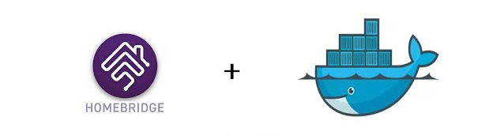
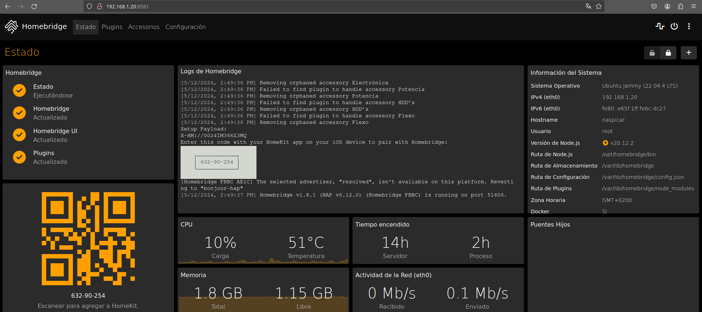

# Homebridge



**Homebridge** es un software de código abierto que permite **hacer compatibles dispositivos inteligentes no compatibles con Apple HomeKit**. Actúa como un puente entre dispositivos que no tienen soporte nativo para HomeKit y la app **Casa** de Apple.  

---

### 🔥 **¿Por qué usar Homebridge?**  
✅ **Añade soporte HomeKit** a dispositivos que no lo tienen (cámaras, luces, sensores, enchufes, etc.).  
✅ **Compatible con cientos de plugins** para integrar marcas como Nest, Ring, TP-Link, Xiaomi, etc.  
✅ **Ligero y eficiente**, puede ejecutarse en Raspberry Pi, PC, Mac o servidores NAS.  
✅ **Control por voz con Siri** y automatizaciones en la app Casa.  
✅ **Integración con Home Assistant y Node-RED**.  

🔹 **Página oficial**: [https://homebridge.io/](https://homebridge.io/)

---

## Instalación

Todos los ficheros relacionados con nuestra instalación de **Homebridge** se alojarán dentro de un directorio ubicado en `~/docker`, a fin de tener organizado nuestro sistema de ficheros.

### Paso 1: Crear la estructura de directorios

Para comenzar, crea la estructura de directorios necesaria en tu sistema:

```bash
mkdir -p ~/docker/homebridge/volume/config
```

### Paso 2: Crear el archivo `docker-compose.yml`

Luego, crea y edita el archivo `docker-compose.yml` en el directorio correspondiente:

```bash
vim ~/docker/homebridge/docker-compose.yml
```

### Paso 3: Estructura de directorios esperada

Antes de iniciar el contenedor, la estructura del sistema de ficheros debería quedar organizada de la siguiente manera:

```bash
$ tree ~

~/docker/homebridge
├── docker-compose.yml
└── volume
    └── config
```

---

## Despliegue de `docker-compose.yml`

Para desplegar el contenedor de **Homebridge**, puedes hacerlo tanto desde **Portainer** como desde la línea de comandos usando Docker Compose. Si optas por la segunda opción, ejecuta el siguiente comando para levantar el contenedor:

```bash
$ docker-compose up -d

# Puedes 'bajar' el contenedor mediante
$ docker-compose down

# Puedes ver la salida de log usando
$ docker logs -f <ID_CONTENEDOR>
```

### Contenido del archivo `docker-compose.yml`

Este es el contenido del archivo `docker-compose.yml` que necesitas para configurar tu contenedor de **Homebridge**:

```yaml
services:

  # ================== Homebridge
  homebridge:
    image: homebridge/homebridge:latest
    container_name: homebridge            # Nombre del contenedor
    restart: unless-stopped               # Política de reinicio del contenedor

    environment:
      - TZ=Europe/Madrid
      - PGID=1000
      - PUID=1000

    network_mode: host                    # Se expone en el puerto 8581

    volumes:
      - config:/homebridge

    logging:
      driver: json-file
      options:
        max-size: "10mb"
        max-file: "1"

volumes:
  config:
    driver_opts:
      type: none
      device: ~/docker/homebridge/volume/config
      o: bind
```

---

## Acceso

Una vez que el contenedor esté desplegado y funcionando, podrás acceder a la interfaz web de **Homebridge** a través de tu navegador. Simplemente ingresa la siguiente URL en la barra de direcciones:

```
http://ip-server:8581
```

Sustituye `ip-server` por la IP de tu dispositivo.

---

## Configuración

Para tener conexión con las distintas marcas de dispositivos, hay que usar el buscador de plugins.

Por ejemplo, para añadir elementos de `smart life` hay que seguir las indicaciones de la siguiente animación.

