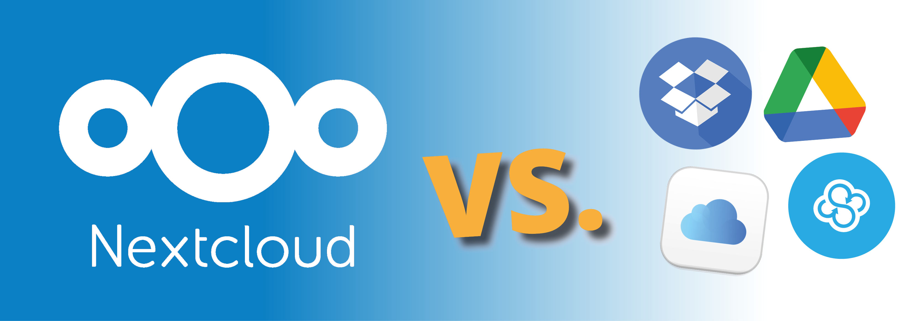

# Nextcloud



**Nextcloud** es una plataforma de almacenamiento en la nube de código abierto que te permite crear tu propio servicio similar a **Google Drive, Dropbox o OneDrive**, pero alojado en tu propio servidor.

### 🌟 **¿Por qué usar Nextcloud?**  
✅ **Almacenamiento en la nube privado y seguro**.  
✅ **Acceso desde cualquier dispositivo** (PC, móvil, navegador).  
✅ **Sin límites de espacio** (depende de tu disco duro).  
✅ **Sin depender de terceros** como Google o Microsoft.  
✅ **Sincronización automática de archivos y copias de seguridad**.  
✅ **Colaboración en tiempo real** (documentos, calendarios, contactos, tareas).  
✅ **Extensible con apps** (OnlyOffice, Collabora, Talk, Notes, etc.).  

Si quieres **control total sobre tus archivos y datos en la nube**, Nextcloud es una de las **mejores soluciones**.  

🔹 **Página oficial**: [https://nextcloud.com](https://nextcloud.com)

---

## Instalación

Todos los ficheros relacionados con nuestra instalación de **Nextcloud** se alojarán dentro de un directorio ubicado en `~/docker`, a fin de tener organizado nuestro sistema de ficheros.

### Paso 1: Crear la estructura de directorios

Para comenzar, crea la estructura de directorios necesaria en tu sistema:

```bash
mkdir -p ~/docker/nextcloud/volume/{config,data}
```

### Paso 2: Crear el archivo `docker-compose.yml`

Luego, crea y edita el archivo `docker-compose.yml` en el directorio correspondiente:

```bash
vim ~/docker/nextcloud/docker-compose.yml
```

### Paso 3: Estructura de directorios esperada

Antes de iniciar el contenedor, la estructura del sistema de ficheros debería quedar organizada de la siguiente manera:

```bash
$ tree ~

~/docker/nextcloud
├── docker-compose.yml
└── volume
    ├── config
    └── data
```

---

## Despliegue de `docker-compose.yml`

Para desplegar el contenedor de **Nextcloud**, puedes hacerlo tanto desde **Portainer** como desde la línea de comandos usando Docker Compose. Si optas por la segunda opción, ejecuta el siguiente comando para levantar el contenedor:

```bash
$ docker-compose up -d

# Puedes 'bajar' el contenedor mediante
$ docker-compose down

# Puedes ver la salida de log usando
$ docker logs -f <ID_CONTENEDOR>
```

### Contenido del archivo `docker-compose.yml`

Este es el contenido del archivo `docker-compose.yml` que necesitas para configurar tu contenedor de **Nextcloud**:

```yaml
services:

  # ================== Nextcloud
  nextcloud:
    image: lscr.io/linuxserver/nextcloud:latest
    container_name: nextcloud              # Nombre del contenedor
    restart: unless-stopped                # Política de reinicio del contenedor
    
    environment:
      PUID: 1000                           # ID de usuario
      PGID: 1000                           # ID de grupo
      TZ: Europe/Madrid                    # Zona horaria
    
    volumes:
      - config:/config                     # Volumen para la configuración de Nextcloud
      - data:/data                         # Volumen para los datos de Nextcloud

    ports:
      - 443:443                            # Puerto para HTTPS
    
volumes:
  config:                                  # Volumen para la configuración de Nextcloud
    driver_opts:
      type: none
      device: ~/docker/nextcloud/volume/config
      o: bind
  data:                                    # Volumen para los datos de Nextcloud
    driver_opts:
      type: none
      device: ~/docker/nextcloud/volume/data
      o: bind
```

---

## Acceso

Una vez que el contenedor esté desplegado y funcionando, podrás acceder a la interfaz web de **Nextcloud** a través de tu navegador. Simplemente ingresa la siguiente URL en la barra de direcciones:

```
http://ip-server:443
```

Sustituye `ip-server` por la IP de tu dispositivo.