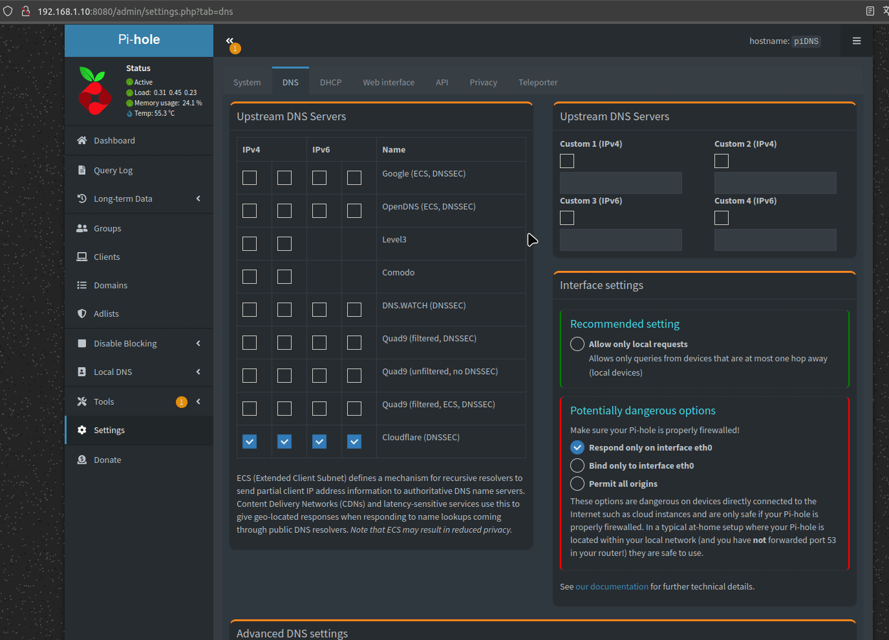

# Pi-Hole


**Pi-hole** es un bloqueador de anuncios y rastreadores a nivel de red. Se instala en un servidor o una Raspberry Pi y actúa como un **servidor DNS** que filtra solicitudes de dominios de publicidad y rastreo, bloqueándolos antes de que lleguen a los dispositivos de la red. 

### 🌟 **¿Por qué usar Pi-hole?**  
✅ **Bloquea anuncios en toda la red** (YouTube, apps, juegos, Smart TVs, etc.).  
✅ **Mejora la velocidad de navegación** (menos anuncios = menos carga).  
✅ **Protege la privacidad** (evita rastreadores y recopilación de datos).  
✅ **Reduce el consumo de ancho de banda**.  
✅ **Funciona con cualquier dispositivo** sin necesidad de instalar extensiones.  
✅ **Interfaz web para monitoreo y configuración**. 

🔹 **Página oficial**: [https://pi-hole.net](https://pi-hole.net) 

---

## Instalación

Todos los ficheros relacionados con nuestra instalación de **Pi-hole** se alojarán dentro de un directorio ubicado en `~/docker`, a fin de tener organizado nuestro sistema de ficheros.

### Paso 1: Crear la estructura de directorios

Para comenzar, crea la estructura de directorios necesaria en tu sistema:

```bash
mkdir -p ~/docker/pihole/volume/{etc,dnsmasq,logs}
```

### Paso 2: Crear el archivo `docker-compose.yml`

Luego, crea y edita el archivo `docker-compose.yml` en el directorio correspondiente:

```bash
vim ~/docker/pihole/docker-compose.yml
```

### Paso 3: Estructura de directorios esperada

Antes de iniciar el contenedor, la estructura del sistema de ficheros debería quedar organizada de la siguiente manera:

```bash
$ tree ~

~/docker/pihole
├── docker-compose.yml
└── volume
    ├── dnsmasq
    ├── etc
    └── logs
```

## Pasos previos
En primer lugar debemos deshabilitar el servicio `systemd-resolved` ya que este servicio es el encargado de resolver los `dns` y por lo tanto opera en el puerto `53` al igual que `pi-hole`. Así que es neceario deshabilitarlo.

```bash
sudo systemctl stop systemd-resolved
sudo systemctl disable systemd-resolved

## Aunque también se puede tener instalado este servidor DNS (avahi-daemon)
sudo systemctl stop avahi-daemon
sudo systemctl disable avahi-daemon
sudo systemctl status avahi-daemon

```

Seguidamente debemos editar el `dns` en el archivo `resolv.conf`.

```bash
sudo cp /etc/resolv.conf /etc/resolv_old.conf
sudo vim /etc/resolv.conf

  nameserver 127.0.0.1

sudo chattr +i /etc/resolv.conf # Para que ningún proceso lo pueda sobreescribir
sudo reboot
```

---

## Despliegue de `docker-compose.yml`

Para desplegar el contenedor de **Pi-hole**, puedes hacerlo tanto desde **Portainer** como desde la línea de comandos usando Docker Compose. Si optas por la segunda opción, ejecuta el siguiente comando para levantar el contenedor:

```bash
$ docker-compose up -d

# Puedes 'bajar' el contenedor mediante
$ docker-compose down

# Puedes ver la salida de log usando
$ docker logs -f <ID_CONTENEDOR>
```

### Contenido del archivo `docker-compose.yml`

Este es el contenido del archivo `docker-compose.yml` que necesitas para configurar tu contenedor de **Pi-hole**:

```yaml
services:

  # ================== Pi-hole
  pihole:
    image: pihole/pihole:latest
    container_name: pihole              # Nombre del contenedor
    restart: unless-stopped             # Política de reinicio del contenedor
    
    environment:
      TZ: Europe/Madrid                 # Zona horaria
      WEBPASSWORD: carmeloPI3           # Contraseña para la interfaz web
    
    hostname: carmeloPI3

    ports:
      - 53:53/tcp                       # Mapeo de puertos TCP para DNS
      - 53:53/udp                       # Mapeo de puertos UDP para DNS
      - 8080:80/tcp                     # Puerto para la interfaz web (HTTP)
    
    volumes:
      - etc:/etc/pihole                 # Volumen para configuración de Pi-hole
      - dnsmasq:/etc/dnsmasq.d          # Volumen para configuración de dnsmasq
      - logs:/var/log/pihole            # Volumen para logs
    
volumes:
  etc:                                  # Volumen para configuración de Pi-hole
    driver_opts:
      type: none
      device: ~/docker/pihole/volume/etc
      o: bind
  dnsmasq:                              # Volumen para configuración de dnsmasq
    driver_opts:
      type: none
      device: ~/docker/pihole/volume/dnsmasq
      o: bind
  logs:                                 # Volumen para logs
    driver_opts:
      type: none
      device: ~/docker/pihole/volume/logs
      o: bind
```

---

## Acceso

Una vez que el contenedor esté desplegado y funcionando, podrás acceder a la interfaz web de **Pi-hole** a través de tu navegador. Simplemente ingresa la siguiente URL en la barra de direcciones:

```
http://ip-server:8080
```

Sustituye `ip-server` por la IP de tu dispositivo.

---

## Configuración extra
En primer lugar, es importantísimo configurar nuestro servidor con IP estática (dentro de nuestro router), para así poder usar esta IP como servidor DNS (en mi caso he usado 192.168.1.10).

Después se debe configurar unas DNS para nuestro servidor DNS, es decir, como la Rasp solo nos hará de puente, filtrando todos los dominios de publicidad, hay que proporcionarle unas DNS, para el resto de dominios. Así que eso se configura aquí:



Por otro lado, se pueden añadir más elementos a las listas negras de PiHole, busca en este lugar (aconsejable usar solo las listas marcadas en verde, aunque puedes leer la información de la página y sacar tus conclusiones) "[The Big Blocklist Collection](https://firebog.net/)".

## Revertir cambios
Al desisntalar el servicio de pi-hole, para reestablecer internet en nuestro servidor, deberemos deshacer los cambios hechos en el apartado [`Pasos previos`](#pasos-previos)

Por lo que debemos editar el `dns` en el archivo `resolv.conf`.

```bash
sudo chattr -i /etc/resolv.conf
sudo rm -f /etc/resolv.conf
sudo cp /etc/resolv_old.conf /etc/resolv.conf
sudo reboot
```

Y después habilitaremos de nuevo el servicio `systemd-resolved`.

```bash
sudo systemctl enable systemd-resolved
sudo systemctl start systemd-resolved
```
