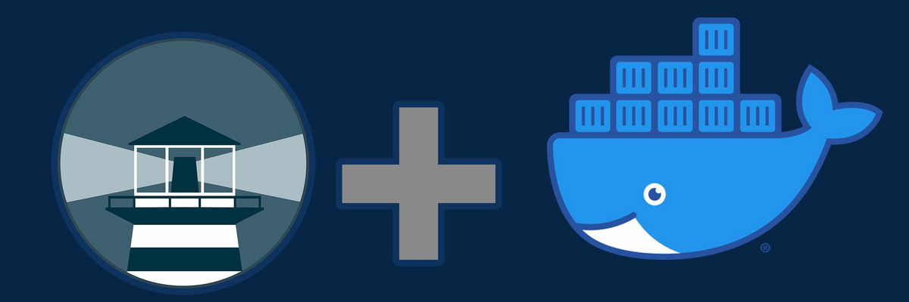

# WatchTower



**Watchtower** es una herramienta de código abierto que automatiza la actualización de contenedores Docker. Monitorea los contenedores en ejecución y, cuando detecta que hay nuevas versiones de las imágenes utilizadas, actualiza y reinicia los contenedores correspondientes para que utilicen las versiones más recientes.

**Características principales de Watchtower:**

- **Actualizaciones automáticas:** Detecta y aplica actualizaciones de imágenes de contenedores sin intervención manual, asegurando que tus aplicaciones estén siempre al día con las últimas mejoras y parches de seguridad.

- **Monitoreo constante:** Supervisa continuamente los contenedores en ejecución y verifica la disponibilidad de nuevas versiones de sus imágenes asociadas. 

- **Fácil implementación:** Se ejecuta como un contenedor Docker independiente que interactúa con el socket de Docker del host para gestionar otros contenedores, facilitando su instalación y configuración.

**Consideraciones:**

Watchtower está diseñado principalmente para entornos como laboratorios caseros, centros de medios y entornos de desarrollo locales. No se recomienda su uso en entornos comerciales o de producción, donde soluciones más robustas como Kubernetes podrían ser más adecuadas. 

Para más información, puedes visitar el sitio oficial de Watchtower: 

🔹 **Página oficial**: [https://containrrr.dev/watchtower/](https://containrrr.dev/watchtower/)

---

## Instalación

Todos los ficheros relacionados con nuestra instalación de **Watchtower** se alojarán dentro de un directorio ubicado en `~/docker`, a fin de tener organizado nuestro sistema de ficheros.

### Paso 1: Crear la estructura de directorios

Para comenzar, crea la estructura de directorios necesaria en tu sistema:

```bash
mkdir -p ~/docker/watchtower/volume
```

### Paso 2: Crear el archivo `docker-compose.yml`

Luego, crea y edita el archivo `docker-compose.yml` en el directorio correspondiente:

```bash
vim ~/docker/watchtower/docker-compose.yml
```

### Paso 3: Estructura de directorios esperada

Antes de iniciar el contenedor, la estructura del sistema de ficheros debería quedar organizada de la siguiente manera:

```bash
$ tree ~

~/docker/watchtower
├── docker-compose.yml
└── volume
```

---

## Despliegue de `docker-compose.yml`

Para desplegar el contenedor de **Watchtower**, puedes hacerlo tanto desde **Portainer** como desde la línea de comandos usando Docker Compose. Si optas por la segunda opción, ejecuta el siguiente comando para levantar el contenedor:

```bash
$ docker-compose up -d

# Puedes 'bajar' el contenedor mediante
$ docker-compose down

# Puedes ver la salida de log usando
$ docker logs -f <ID_CONTENEDOR>
```

### Contenido del archivo `docker-compose.yml`

Este es el contenido del archivo `docker-compose.yml` que necesitas para configurar tu contenedor de **Watchtower**:

```yaml
services:

  #================== watchtower  
  watchtower:
    image: containrrr/watchtower:latest
    container_name: watchtower        # Nombre del contenedor
    restart: unless-stopped           # Política de reinicio del contenedor
    
    environment:
      - TZ=Europe/Madrid                 # Zona horaria
      - WATCHTOWER_CLEANUP=true          # Remove old images after updetes
      - WATCHTOWER_REMOVE_VOLUMES=true   # Removes anonymous volumes after updating
      - WATCHTOWER_LOG_FORMAT=Pretty     # Sets what logging format to use for console output.
      - WATCHTOWER_POLL_INTERVAL=86400   # Tiempo en seg. (revisa cada día)
      - WATCHTOWER_MONITOR_ONLY=true     # Modo monitor, solo informa

    volumes:
      - /var/run/docker.sock:/var/run/docker.sock
```

---

## Acceso y configuración
Está configurado como modo 'Monitor' por lo que no hará ningún cambio. Para  revisar si hay algún contenedor que actualizar, hay que revisar los logs del contenedor de 'watchtower', y en él vendrá la información.

Ejemplo de ejecución:

```bash
time="2024-05-05T18:35:26+02:00" level=info msg="Watchtower 1.7.1"
time="2024-05-05T18:35:26+02:00" level=info msg="Using no notifications"
time="2024-05-05T18:35:26+02:00" level=info msg="Checking all containers (except explicitly disabled with label)"
time="2024-05-05T18:35:26+02:00" level=info msg="Scheduling first run: 2024-05-05 18:35:36 +0200 CEST"
time="2024-05-05T18:35:26+02:00" level=info msg="Note that the first check will be performed in 9 seconds"
time="2024-05-05T18:35:39+02:00" level=info msg="Session done" Failed=0 Scanned=4 Updated=0 notify=no
time="2024-05-05T18:35:49+02:00" level=info msg="Session done" Failed=0 Scanned=4 Updated=0 notify=no
time="2024-05-05T18:35:59+02:00" level=info msg="Session done" Failed=0 Scanned=4 Updated=0 notify=no
```