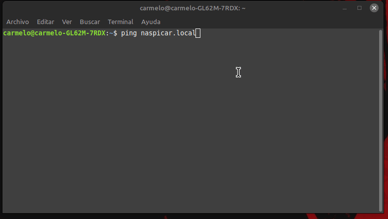

# Inicialización básica


[Inicio de sección](#Header) &nbsp; &nbsp; - &nbsp; &nbsp; [Índice](#índice)
<br><br>

Guía detallada sobre los primeros pasos para configurar una Raspberry Pi, incluyendo la instalación de Raspbian Lite 64bit, Docker, Docker Compose y mhddfs.

# Índice
- [Inicialización básica](#inicialización-básica)
- [Índice](#índice)
- [Instalar Raspbian Lite 64bit](#instalar-raspbian-lite-64bit)
- [Instalar Docker y Docker Compose](#instalar-docker-y-docker-compose)
- [Instalar mhddfs](#instalar-mhddfs)

[<<  >>]()<br>
[Índice](#índice) &nbsp; &nbsp; - &nbsp; &nbsp; [Arriba](#header)
<br><br>

# Instalar Raspbian Lite 64bit

1. **Descargar el instalador "Raspberry Pi Imager"**:
    - Visita la [página oficial de Raspberry Pi](https://www.raspberrypi.com/software/) y descarga `Raspberry Pi Imager`.
    
2. **Grabar la imagen en una tarjeta SD**:
    - Usar la aplicación para grabar la imagen es muy sencillo. Sigue los pasos del siguiente `gif` para hacer la preconfiguración y tener acceso a través de `ssh`.
        ```bash
        anfitrión: naspicar.local
        usuario: naspicar
        ```
        

    - Una vez grabada la imagen, inserta la tarjeta SD en la Raspberry Pi y enciendela.
    
3. **Primer arranque y configuración inicial**:
    - Haremos la configuración a través de `ssh`, así que accederemos desde otro equipo. Aunque también puedes conectar un teclado y monitor y seguir los pasos (salvo el de conexión por 'ssh').
    
    - Para conectarnos por `ssh` debemos conocer `íp` de la raspberry, así que desde la terminal de un pc conectado a la misma red haremos lo siguinte:
        ```bash
        ping naspicar.local # Usamos el nombre del amfitrión del paso anterior
        ```
        

        - Ahora tenemos la ip de nuestra raspberry al descubierto, en mi caso es 192.168.1.245

    - Actualizamos el SO de la Raspberry e instalar algunos paquetes básicos
        ```bash
        sudo apt-get -y update
        sudo apt-get -y upgrade
        sudo apt-get -y dist-upgrade
        sudo apt-get -y vim neofetch cpufetch ranger htop tree
        sudo apt-get -y autoclean
        sudo apt-get -y autoremove
        ```

    - Cambiar la `ip`, por una manual. Yo le asignaré la 192.168.1.20

        1. Conocer la ip de Raspian OS lite
            ```bash
            ip addr
            ```
        2. Conocer cual es la puerta de enlace
            ```bash
            ip route show
            ```
        3. Conocer cual es el servidor DNS
            ```bash
            cat /etc/resolv.conf
            ```
        4. Conocer si está activo el servicio DHCP [(como instalarlo)](../general-linux/redes/dhcp.md)
            ```bash
            service dhcpcd status
            ```
        5. Configurar el fichero modificando estas líneas:
            ```bash
            sudo vim /etc/dhcpcd.conf 

            # Example static IP configuration:
            interface eth0
            static ip_address=192.168.1.20/24
            static routers=192.168.1.1
            static domain_name_servers=192.168.1.10
            ```
        6. Reinicia
            ```bash
            sudo shutdown -r now
            ```
4. **Configuración Raspbian-config**:
    ```bash
    sudo raspi-config

    # Hay que modificar las siguientes opciones
    raspi-config
     ├── 1 System Option
     │   └── S5 Boot / Auto Login
     │       └── B2 Console Autologin
     ├── 5 Localisation Options
     │   ├── L1 Locale
     │   │   └── es_ES.UTF-8 UTF-8
     │   ├── L2 Timezone
     │   │   └── Europe / Madrid
     │   ├── L3 Keyboard
     │   └── L4 WLAN Country
     │       └── ES Spain
     ├── 6 Advanced Options
     │   └── A1 Expand Filesystem
     └── 8 Update

    ```

[Inicio de sección](#instalar-raspbian-lite-64bit) &nbsp; &nbsp; - &nbsp; &nbsp; [Índice](#índice) &nbsp; &nbsp; - &nbsp; &nbsp;[Arriba](#header)
<br><br>

# Instalar Docker y Docker Compose

[Esta sección cubre la instalación de Docker y Docker Compose en tu Raspberry Pi.](./docker.md)


[Inicio de sección](#instalar-docker-y-docker-compose) &nbsp; &nbsp; - &nbsp; &nbsp; [Índice](#índice) &nbsp; &nbsp; - &nbsp; &nbsp;[Arriba](#header)
<br><br>

# Instalar mhddfs

[En esta sección, aprenderás a instalar y configurar mhddfs en tu Raspberry Pi.](../general-linux/sistema-de-archivos/mhddfs.md)

[Inicio de sección](#instalar-mhddfs) &nbsp; &nbsp; - &nbsp; &nbsp; [Índice](#índice) &nbsp; &nbsp; - &nbsp; &nbsp;[Arriba](#header)
<br><br>
