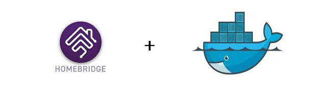
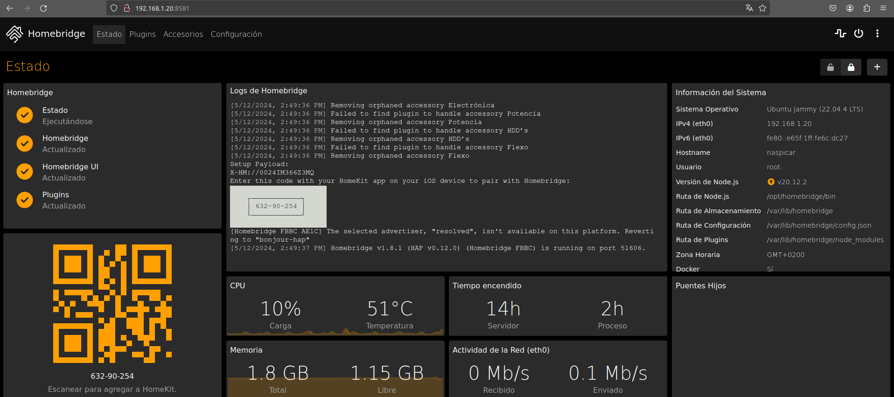

# Homebridge



**Homebridge** es un servidor de software de código abierto que permite la integración de dispositivos domésticos inteligentes no compatibles con HomeKit de Apple en su ecosistema. Funciona como un puente entre diferentes protocolos y estándares de domótica, como Zigbee, Z-Wave, MQTT, entre otros, y la plataforma HomeKit de Apple.

Usar Homebridge en un contenedor Docker simplifica su instalación, ofrece aislamiento y seguridad, y facilita la portabilidad y gestión de la configuración de dispositivos domésticos inteligentes.

[Inicio de sección](#homebridge) &nbsp; &nbsp; - &nbsp; &nbsp; [Índice](#índice)
<br><br>

# Índice
- [Homebridge](#homebridge)
- [Índice](#índice)
- [Definir ruta de instalación](#definir-ruta-de-instalación)
- [Variables de entorno necesarias](#variables-de-entorno-necesarias)
- [Despliegue `docker-compose.yml`](#despliegue-docker-composeyml)
- [Acceso](#acceso)

[<< Raspberry Pi >>](../raspberrypi.md)<br>
[Índice](#índice) &nbsp; &nbsp; - &nbsp; &nbsp;[Arriba](#homebridge)
<br><br>

# Definir ruta de instalación
Todas los ficheros relacionados con nuestra instalación se alojarán dentro de un directorio ubicado en `~/docker`, a fin de tener organizado nuestro sistema de ficheros.

```bash
mkdir -p ~/docker/homebridge/volume/config
vim ~/docker/homebridge/docker-compose.yml

# Esta es la estructura que debe quedar (antes de iniciar el contenedor)
tree ~

HOME/docker/homebridge
├── docker-compose.yml
└── volume
    └── config
```


[Inicio de sección](#definir-ruta-de-instalación) &nbsp; &nbsp; - &nbsp; &nbsp; [Índice](#índice) &nbsp; &nbsp; - &nbsp; &nbsp;[Arriba](#homebridge)
<br><br>

# Variables de entorno necesarias
Esta son las variables de entorno que tenemos que definir para poder levantar nuestro contenedor.

```.env
# NO hay variables 'extras' definidas, solo se usan las própias del SO.
```

[Inicio de sección](#variables-de-entorno-necesarias) &nbsp; &nbsp; - &nbsp; &nbsp; [Índice](#índice) &nbsp; &nbsp; - &nbsp; &nbsp;[Arriba](#homebridge)
<br><br>

# Despliegue `docker-compose.yml`
El despliegue se puede hacer tanto desde `portainer` como desde docker compose con el comando `docker-compose up -d`.

```yaml
version: '3.7'

services:

  # ================== Homebridge
  homebridge:
    image: homebridge/homebridge:latest
    container_name: homebridge                    # Nombre del contenedor
    restart: unless-stopped                     # Política de reinicio del contenedor

    network_mode: host

    volumes:
      - config:/homebridge

    logging:
      driver: json-file
      options:
        max-size: "10mb"
        max-file: "1"

volumes:
  config:
    driver_opts:
      type: none
      device: ${HOME}/docker/homebridge/volume/config
      o: bind
```

[Inicio de sección](#despliegue-docker-composeyml) &nbsp; &nbsp; - &nbsp; &nbsp; [Índice](#índice) &nbsp; &nbsp; - &nbsp; &nbsp;[Arriba](#homebridge)
<br><br>

# Acceso
El aceso se hace mediante navegador web a través de la URL http://ip-raspberry:8581

Para tener conexión con las distintas marcas de dispositivos, hay que usar el buscador de plugins.

Por ejemplo, para añadir elementos de `smart life` hay que seguir las indicaciones de la siguiente animación.



[Inicio de sección](#acceso) &nbsp; &nbsp; - &nbsp; &nbsp; [Índice](#índice) &nbsp; &nbsp; - &nbsp; &nbsp;[Arriba](#samba)
<br><br>