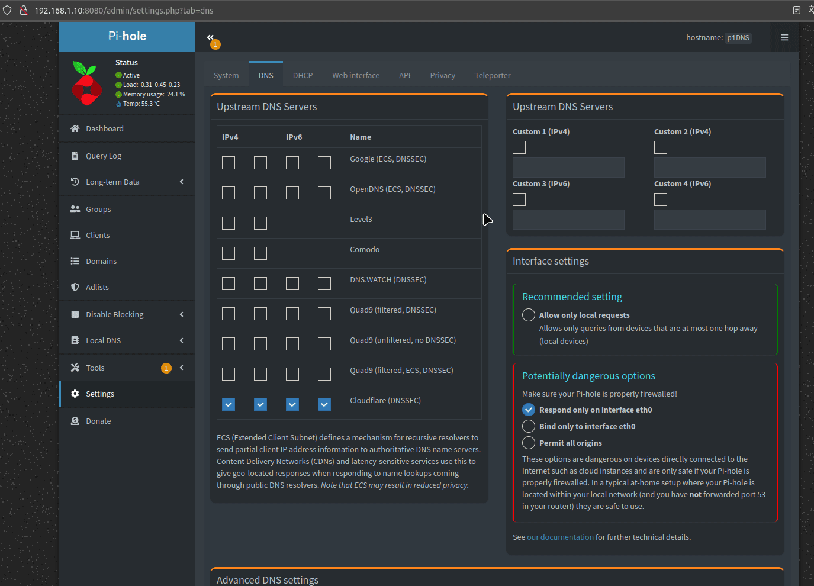

# Pi-Hole


Pi-hole es la mejor solución para terminar con la publicidad intrusiva, tanto de aplicaciones como de sitios web, en todos los dispositivos de nuestra red. Instalandola sobre nuestra Raspberry Pi, esta actuará como servidor DNS.

Existen otras formas de instalación, pero he elegido Docker por las múltiples ventajas que aporta.

[Inicio de sección](#pi-hole) &nbsp; &nbsp; - &nbsp; &nbsp; [Índice](#índice)
<br><br>

# Índice
- [Pi-Hole](#pi-hole)
- [Índice](#índice)
- [Definir ruta de instalación](#definir-ruta-de-instalación)
- [Variables de entorno necesarias](#variables-de-entorno-necesarias)
- [Pasos previos](#pasos-previos)
- [Despliegue `docker-compose.yml`](#despliegue-docker-composeyml)
- [Acceso](#acceso)
- [Configuración extra](#configuración-extra)
- [Revertir cambios](#revertir-cambios)

[<< Raspberry Pi >>](../raspberrypi.md)<br>
[Índice](#índice) &nbsp; &nbsp; - &nbsp; &nbsp;[Arriba](#pi-hole)
<br><br>

# Definir ruta de instalación
Todas los ficheros relacionados con nuestra instalación se alojarán dentro de un directorio ubicado en `~/docker`, a fin de tener organizado nuestro sistema de ficheros.

```bash
mkdir -p ~/docker/pihole/volume/{etc,dnsmasq}
vim ~/docker/pihole/docker-compose.yml

# Esta es la estructura que debe quedar (antes de iniciar el contenedor)
tree ~

HOME/docker/pihole
├── docker-compose.yml
└── volume
    ├── dnsmasq
    └── etc
```


[Inicio de sección](#definir-ruta-de-instalación) &nbsp; &nbsp; - &nbsp; &nbsp; [Índice](#índice) &nbsp; &nbsp; - &nbsp; &nbsp;[Arriba](#pi-hole)
<br><br>

# Variables de entorno necesarias
Esta son las variables de entorno que tenemos que definir para poder levantar nuestro contenedor.

```.env
# NO hay variables 'extras' definidas, solo se usan las própias del SO.
```

[Inicio de sección](#variables-de-entorno-necesarias) &nbsp; &nbsp; - &nbsp; &nbsp; [Índice](#índice) &nbsp; &nbsp; - &nbsp; &nbsp;[Arriba](#pi-hole)
<br><br>

# Pasos previos
En primer lugar debemos deshabilitar el servicio `systemd-resolved` ya que este servicio es el encargado de resolver los `dns` y por lo tanto opera en el puerto `53` al igual que `pi-hole`. Así que es neceario deshabilitarlo.

```bash
sudo systemctl stop systemd-resolved
sudo systemctl disable systemd-resolved
```

Seguidamente debemos editar el `dns` en el archivo `resolv.conf`.

```bash
sudo vim /etc/resolv.conf

## Tendremos algo tal que esto
nameserver 127.0.0.53

## Lo sustituimos por esto
# Cloudflare DNS primario
nameserver 1.1.1.1
# Cloudflare DNS secundario
nameserver 1.0.0.1
```

[Inicio de sección](#pasos-previos) &nbsp; &nbsp; - &nbsp; &nbsp; [Índice](#índice) &nbsp; &nbsp; - &nbsp; &nbsp;[Arriba](#pi-hole)
<br><br>


# Despliegue `docker-compose.yml`
El despliegue se puede hacer tanto desde `portainer` como desde docker compose con el comando `docker-compose up -d`.

¡OJO! He observado que en portainer las variables de entorno pueden dar problemas.

```yaml
version: '3.7'

services:

  # ================== Pi-hole
  pihole:
    image: pihole/pihole:latest
    container_name: pihole              # Nombre del contenedor
    restart: unless-stopped             # Política de reinicio del contenedor
    
    environment:
      TZ: Europe/Madrid                 # Zona horaria
      WEBPASSWORD: carmelo              # Contraseña para la interfaz web
      FTLCONF_LOCAL_IPV4: 192.168.1.20  # Dirección IP local del dispositivo
    
    hostname: naspicar

    ports:
      - 53:53/tcp                       # Mapeo de puertos TCP para DNS
      - 53:53/udp                       # Mapeo de puertos UDP para DNS
      - 8080:80/tcp                     # Puerto para la interfaz web (HTTP)
      - 443:443                         # Puerto para la interfaz web (HTTPS)
    
    volumes:
      - etc:/etc/pihole                 # Volumen para configuración de Pi-hole
      - dnsmasq:/etc/dnsmasq.d          # Volumen para configuración de dnsmasq
      
    dns:
      - 1.1.1.1                         # Configuración de servidores DNS
      - 1.0.0.1
    
volumes:
  etc:                                  # Volumen para configuración de Pi-hole
    driver_opts:
      type: none
      device: ${HOME}/docker/pihole/volume/etc
      o: bind
  dnsmasq:                              # Volumen para configuración de dnsmasq
    driver_opts:
      type: none
      device: ${HOME}/docker/pihole/volume/dnsmasq
      o: bind
```

[Inicio de sección](#despliegue-docker-composeyml) &nbsp; &nbsp; - &nbsp; &nbsp; [Índice](#índice) &nbsp; &nbsp; - &nbsp; &nbsp;[Arriba](#pi-hole)
<br><br>

# Acceso
El aceso se hace mediante navegador web a través de la URL http://ip-raspberry:8080/admin/login.php

[Inicio de sección](#acceso) &nbsp; &nbsp; - &nbsp; &nbsp; [Índice](#índice) &nbsp; &nbsp; - &nbsp; &nbsp;[Arriba](#pi-hole)
<br><br>

# Configuración extra
En primer lugar, es importantísimo configurar nuestra raspberry con IP estática (dentro de nuestro router), para así poder usar esta IP como servidor DNS (en mi caso he usado 192.168.1.10).

Después se debe configurar unas DNS para nuestro servidor DNS, es decir, como la Rasp solo nos hará de puente, filtrando todos los dominios de publicidad, hay que proporcionarle unas DNS, para el resto de dominios. Así que eso se configura aquí:




[Inicio de sección](#configuración-extra) &nbsp; &nbsp; - &nbsp; &nbsp; [Índice](#índice) &nbsp; &nbsp; - &nbsp; &nbsp;[Arriba](#pi-hole)
<br><br>

# Revertir cambios
Al desisntalar el servicio de pi-hole, para reestablecer internet en nuestra raspberry, deberemos deshacer los cambios hechos en el apartado [`Pasos previos`](#pasos-previos)


Por lo que debemos editar el `dns` en el archivo `resolv.conf`.

```bash
sudo vim /etc/resolv.conf

## Tendremos algo tal que esto
# Cloudflare DNS primario
nameserver 1.1.1.1
# Cloudflare DNS secundario
nameserver 1.0.0.1


## Lo sustituimos por esto
nameserver 127.0.0.53

```


Y después habilitaremos de nuevo el servicio `systemd-resolved`.

```bash
sudo systemctl enable systemd-resolved
sudo systemctl start systemd-resolved
```

[Inicio de sección](#revertir-cambios) &nbsp; &nbsp; - &nbsp; &nbsp; [Índice](#índice) &nbsp; &nbsp; - &nbsp; &nbsp;[Arriba](#pi-hole)
<br><br>
