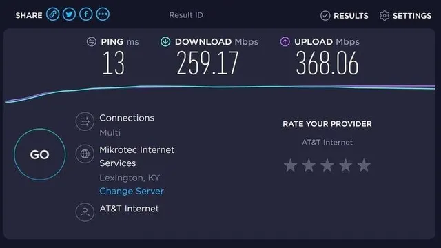

# SpeedTest Tracker




**Speedtest Tracker** es una aplicación autoalojada para el seguimiento del rendimiento de internet que ejecuta pruebas de velocidad utilizando el servicio de Speedtest de Ookla.

- Beneficios de Speedtest Tracker<br>
    Speedtest Tracker permite construir un historial del rendimiento de la conexión a internet, proporcionando información valiosa sobre las velocidades reales en comparación con las velocidades publicitadas por el proveedor de servicios de internet (ISP). Además, ofrece una amplia gama de datos útiles para aquellos interesados en el análisis detallado del rendimiento de su conexión.

- Comparación con otras versiones<br>
    El proyecto original [Speedtest Tracker](https://github.com/henrywhitaker3/Speedtest-Tracker) de Henry Whitaker ha sido abandonado. [Esta versión](https://docs.speedtest-tracker.dev/) es un reemplazo mantenido activamente, con una interfaz de usuario mejorada y un conjunto de características ampliado.

[Inicio de sección](#speedtest-tracker) &nbsp; &nbsp; - &nbsp; &nbsp; [Índice](#índice)
<br><br>

# Índice
- [SpeedTest Tracker](#speedtest-tracker)
- [Índice](#índice)
- [Definir ruta de instalación](#definir-ruta-de-instalación)
- [Variables de entorno necesarias](#variables-de-entorno-necesarias)
- [Despliegue `docker-compose.yml`](#despliegue-docker-composeyml)
- [Acceso](#acceso)
- [Configuración Inicial](#configuración-inicial)

[<< Raspberry Pi >>](../raspberrypi.md)<br>
[Índice](#índice) &nbsp; &nbsp; - &nbsp; &nbsp;[Arriba](#speedtest-tracker)
<br><br>

# Definir ruta de instalación
Todas los ficheros relacionados con nuestra instalación se alojarán dentro de un directorio ubicado en `~/docker`, a fin de tener organizado nuestro sistema de ficheros.

```bash
mkdir -p ~/docker/speedtest-tracker/volume/data
vim ~/docker/speedtest-tracker/docker-compose.yml

# Esta es la estructura que debe quedar (antes de iniciar el contenedor)
tree ~

HOME/docker/speedtest-tracker
├── docker-compose.yml
└── volume
    └── data
```


[Inicio de sección](#definir-ruta-de-instalación) &nbsp; &nbsp; - &nbsp; &nbsp; [Índice](#índice) &nbsp; &nbsp; - &nbsp; &nbsp;[Arriba](#speedtest-tracker)
<br><br>

# Variables de entorno necesarias
Esta son las variables de entorno que tenemos que definir para poder levantar nuestro contenedor.

```.env
# NO hay variables 'extras' definidas, solo se usan las própias del SO.
```

[Inicio de sección](#variables-de-entorno-necesarias) &nbsp; &nbsp; - &nbsp; &nbsp; [Índice](#índice) &nbsp; &nbsp; - &nbsp; &nbsp;[Arriba](#speedtest-tracker)
<br><br>

# Despliegue `docker-compose.yml`
El despliegue se puede hacer tanto desde `portainer` como desde docker compose con el comando `docker-compose up -d`.

```yaml
version: '3.7'

services:

  # ================== SpeedTest Tracker
    speedtest-tracker:
        image: linuxserver/speedtest-tracker:latest
        container_name: speedtest-tracker
        restart: unless-stopped

        environment:
            - PUID=1000
            - PGID=1000
            - DB_CONNECTION=sqlite
            - APP_KEY=base64:JwidBPN+jiSoy8ijbDtBvLHliWh38l8Dwzz8bfdagFw=
            - TZ=Europe/Madrid                  # Zona horaria
            - APP_TIMEZONE=Europe/Madrid        # Zona horaria

            - SPEEDTEST_SCHEDULE=*/15 * * * *   # El test se ejecutará cada 15 minutos
            # - SPEEDTEST_SERVERS=
            # - PRUNE_RESULTS_OLDER_THAN=
            # - CHART_DATETIME_FORMAT= 
            # - DATETIME_FORMAT=
            # - TELEGRAM_BOT_TOKEN=
        
        ports:
            - 8003:80
            - 9444:443

        volumes:
            - data:/config
    
volumes:
  data:                                         # Volumen para configuración de SpeedTest Tracker
    driver_opts:
      type: none
      device: $HOME/docker/speedtest-tracker/volume/data
      o: bind
```

Ejemplos para configurar la variable de entorno `SPEEDTEST_SCHEDULE`

| Cron expression | Schedule                           |
|-----------------|------------------------------------|
| * * * * *       | Every minute                       |
| */5 * * * *     | Every 5 minute                     |
| 0 * * * *       | Every hour                         |
| 0 0 * * *       | Every day at 12:00 AM              |
| 0 0 * * FRI     | At 12:00 AM, only on Friday        |
| 0 0 1 * *       | At 12:00 AM, on day 1 of the month |

[Inicio de sección](#despliegue-docker-composeyml) &nbsp; &nbsp; - &nbsp; &nbsp; [Índice](#índice) &nbsp; &nbsp; - &nbsp; &nbsp;[Arriba](#speedtest-tracker)
<br><br>

# Acceso
El aceso se hace mediante navegador web a través de la URL http://ip-raspberry:9080

[Inicio de sección](#acceso) &nbsp; &nbsp; - &nbsp; &nbsp; [Índice](#índice) &nbsp; &nbsp; - &nbsp; &nbsp;[Arriba](#speedtest-tracker)
<br><br>

# Configuración Inicial
En el siguiente enlace tienes el acceso a la documentación oficial: [https://docs.speedtest-tracker.dev/security/authentication](https://docs.speedtest-tracker.dev/security/authentication)

1. Entrar por primera vez, usar las credenciales iniciales:
    | Username          | Password |
    |-------------------|----------|
    | admin@example.com | password |

2. Cambiar estar credenciales en tras el primer inicio en el apartado `USER`.


[Inicio de sección](#configuración-inicial) &nbsp; &nbsp; - &nbsp; &nbsp; [Índice](#índice) &nbsp; &nbsp; - &nbsp; &nbsp;[Arriba](#speedtest-tracker)
<br><br>