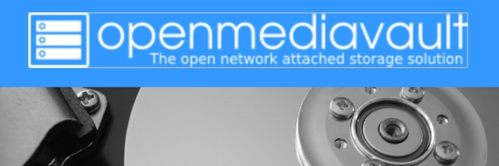

# Open Media Vault - omv



[OpenMediaVault (OMV)](https://www.openmediavault.org/) es un sistema operativo de red de código abierto diseñado para gestionar y compartir archivos en una red doméstica o empresarial. Está basado en Debian y proporciona una interfaz web fácil de usar para administrar almacenamiento, compartir archivos, realizar copias de seguridad y configurar servicios de red.

**Características Principales:**

- **Administración de Almacenamiento:** OpenMediaVault permite administrar discos duros, particiones, RAID y sistemas de archivos desde una interfaz web intuitiva.

- **Compartición de Archivos:** Facilita la creación de carpetas compartidas en red, permitiendo a los usuarios acceder a archivos a través de protocolos como SMB/CIFS, NFS, FTP y WebDAV.

- **Servicios de Red:** Ofrece una variedad de servicios de red integrados, incluyendo un servidor de medios DLNA/UPnP, un servidor de impresión, un servidor de descargas BitTorrent y más.

- **Copia de Seguridad:** Permite realizar copias de seguridad programadas de archivos y configuraciones importantes, tanto localmente como en dispositivos externos.

- **Gestión de Usuarios y Permisos:** Facilita la creación de usuarios y grupos, así como la configuración de permisos de acceso para garantizar la seguridad de los datos.

**Usos Comunes:**

- **Servidor de Almacenamiento en Casa:** OpenMediaVault es ideal para configurar un servidor de almacenamiento en casa para compartir archivos, realizar copias de seguridad y alojar medios multimedia.

- **Servidor de Almacenamiento en la Empresa:** En entornos empresariales, OMV se puede utilizar para gestionar y compartir archivos en una red local, proporcionando un almacenamiento centralizado y seguro.

- **Servidor de Medios de Comunicación:** Con su servidor de medios integrado, OpenMediaVault puede utilizarse para almacenar y distribuir archivos multimedia en toda la red.

- **Servidor de Copias de Seguridad:** Al permitir la programación de copias de seguridad automáticas, OMV es una solución conveniente para mantener a salvo los datos importantes.

**Conclusión:**

OpenMediaVault es una solución versátil y fácil de usar para gestionar el almacenamiento y los servicios de red en una red doméstica o empresarial. Con su enfoque en la simplicidad y la flexibilidad, es una opción popular para aquellos que buscan una forma sencilla de administrar sus datos y servicios en red.

[Inicio de sección](#open-media-vault---omv) &nbsp; &nbsp; - &nbsp; &nbsp; [Índice](#índice)
<br><br>

# Índice
1. [A tener en cuenta](#a-tener-en-cuenta)
2. [Instalación](#instalación)
3. [Configuración básica](#configuración-básica)
4. [Añadir HDD's](#añadir-hdds)


https://www.youtube.com/watch?v=vwg4oLCBA_w

[<< Raspberry Pi >>](./raspberrypi.md)<br>
[Índice](#índice) &nbsp; &nbsp; - &nbsp; &nbsp;[Arriba](#open-media-vault---omv)
<br><br>

## A tener en cuenta

Instalar OpenMediaVault (OMV) en una Raspberry Pi puede ser una excelente opción para crear un servidor de archivos y medios en casa, pero hay algunas consideraciones importantes que debes tener en cuenta:

1. **Raspberry Pi Model:** Asegúrate de usar un modelo compatible con OpenMediaVault y que tenga suficiente potencia para las funciones que necesitas.
2. **Almacenamiento:** Usa discos duros externos o unidades USB compatibles y alimentados por separado para evitar problemas de energía.
3. **Instalación:** Elige la imagen correcta del sistema operativo para tu modelo de Raspberry Pi y sigue las instrucciones de instalación de OpenMediaVault.
4. **Rendimiento:** La Raspberry Pi puede tener un rendimiento limitado, especialmente al ejecutar múltiples servicios o aplicaciones intensivas.
5. **Temperatura:** Asegúrate de una buena ventilación para evitar el sobrecalentamiento, especialmente durante el uso prolongado.
6. **Compatibilidad de Hardware:** Verifica la compatibilidad de hardware adicional, como discos duros externos o adaptadores de red, con OpenMediaVault y tu sistema operativo.
7. **Seguridad:** Configura contraseñas fuertes, limita el acceso y considera la posibilidad de habilitar el cifrado para proteger tus datos.

Por último, la instalación deberá ser sobre un sistema Debian Lite (sin entorno gráfico), y no podrá usarse (al menos a día de hoy, Mayo 2024) imágenes docker, ya que el sistema necesita acceso a **systemd**.

[Inicio de sección](#primeros-pasos) &nbsp; &nbsp; - &nbsp; &nbsp; [Índice](#índice) &nbsp; &nbsp; - &nbsp; &nbsp;[Arriba](#open-media-vault---omv)
<br><br>

## Instalación
Parte (o toda) la información ha sido extraida de la [página oficial](https://wiki.omv-extras.org/doku.php?id=omv6:raspberry_pi_install).

### Hardware
* **Host:** Raspberry Pi 4 Model B Rev 1.4 
* **CPU:** (4) @ 1.800GHz 
* **Memory:** 2GB
* **MicroSD:** 64GB

### Preparación de la MicroSD
* Se ha seguido los pasos de la [web oficial](https://www.raspberrypi.com/software/) para instalar **Raspberry Pi Imager** en nuestro host, y así tener una instalación guiada.
* Como Sistema Operativo se ha elegido **Raspberry Pi OS Lite 64-bit**.
* A la hora de generar la imagen se ha editado los ajustes a través de **Raspberry Pi Imager**:
  * En "GENERAL":
    * Elegir un nombre de anfitrión (por defecto *raspberrypi*).
    * Establecer un usuario y contraseña.
    * Establecer los parámetros de conexión WIFI, aunque es preferible el conexionado mediante red ethernet.
    * Establecer los ajustes regionales *"Europe/Madrid"*, *es*.
  * En "SERVICIOS":
    * Activar SSH usando contraseña.
* Una vez terminado el proceso de formateo, insertar la MicroSD en la raspberry pi y conectarla, tanto a la red eléctrica como a internet (preferiblemente ethernet).

### Accediendo a la Raspberry Pi
Para descubrir cual es la IP de la Raspberry Pi una vez iniciada y conectada a la LAN, solo es necesario los siguientes comandos:

```bash
# Paso 1: Debes tener en cuenta el 'nombre anfitrión' asignado durante la configuración de la MicroSD.
ping raspberrypi.local


    # Resultado por terminal
    carmelo@carmelo-GL62M-7RDX:~$ ping naspicar.local
    PING naspicar.local (192.168.1.238) 56(84) bytes of data.
    64 bytes from 192.168.1.238 (192.168.1.238): icmp_seq=1 ttl=64 time=52.5 ms
    64 bytes from 192.168.1.238 (192.168.1.238): icmp_seq=2 ttl=64 time=1.76 ms
    64 bytes from 192.168.1.238 (192.168.1.238): icmp_seq=3 ttl=64 time=2.09 ms
    64 bytes from 192.168.1.238 (192.168.1.238): icmp_seq=4 ttl=64 time=1.41 ms
    64 bytes from 192.168.1.238 (192.168.1.238): icmp_seq=5 ttl=64 time=2.17 ms

# Paso 2: Debes tener usar el 'usuario' y 'contraseña' asignado durante la configuración de la MicroSD. Así como la ip reportada en el paso anterior.
ssh naspicar@192.168.1.238
```

Una vez que podemos conectarnos a la raspberry pi, se puede [configurar el servicio ssh para acceder sin necesidad de introducir la contraseña](../general-linux/ssh.md#configurar-ssh-para-el-acceso-a-servidor-mediante-clave-pública) cada vez que queramos acceder a ella.


### Configuración inicial

```bash
# Paso 1: Actualizar paquetes del sistema e instalar herramientas útiles
sudo apt-get update -y && sudo apt-get upgrade -y && sudo apt-get dist-upgrade -y
sudo apt-get install -y neofetch vim ranger curl
sudo apt-get autoremove -y && sudo apt-get autoclean -y

# Paso 2: Configuración de la Raspberry Pi
sudo raspi-config
  ## Opción 5: Localisation Options
  ### L1 Locale       --> es_ES.UTF-8 UTF-8
  ### L2 Timezone     --> Europe/Madrid
  ### L3 Keyboard     --> (configurar según tu preferencia)
  ### L4 WLAN Country --> ES
  ## Opción 6: Advanced Options
  ### A1 Expand Filesystem -->

# Paso 3: Reiniciar la Raspberry Pi para aplicar los cambios
sudo reboot
```

### [Instalar Open Media Vault v7](https://wiki.omv-extras.org/doku.php?id=omv7:raspberry_pi_install)

```bash
# Paso 1: Preparación del sistema
sudo apt-get update -y && sudo apt-get upgrade -y
wget -O - https://github.com/OpenMediaVault-Plugin-Developers/installScript/raw/master/preinstall | sudo bash
sudo reboot

# Paso 2: Instalación
wget -O - https://github.com/OpenMediaVault-Plugin-Developers/installScript/raw/master/install | sudo bash
```

[Inicio de sección](#instalación) &nbsp; &nbsp; - &nbsp; &nbsp; [Índice](#índice) &nbsp; &nbsp; - &nbsp; &nbsp;[Arriba](#open-media-vault---omv)
<br><br>

## Configuración básica
En este punto, ya tenemos el servidor NAS operativo, sólo tenemos que [buscar la ip](#accediendo-a-la-raspberry-pi) que el servidor DHCP del router le ha asignado, y hacer uso de un navegador web.

```bash 
http://<ip_raspberrypi>/#/login

# Las credenciales por defecto son:
    ## user: admin
    ## pass: openmediavault
```

### Pasos recomendados
1. **Cambiar pass por defecto:** Iconos de arriba a la derecha, opción *'cambiar contraseña'*.
2. **Cambiar el tiempo de sesión:** Sistema / Área de trabajo.
3. **Habilitar los widget de monitorización:** Dashboard.
4. **Buscar actualizaciones:** Sistema / Gestión de actualizaciones / Actualizaciones.
5. **Configurar una IP fija:** Red / Interfaces / IPv4
   * *Método:* Estático
   * *Dirección:* 192.168.1.20 (una ip fuera del rango dinámico DHCP del router).
   * *Máscara de subred:* 255.255.255.0
   * *Gateway:* 192.168.1.1 (ip de nuestro router)
   * *DNS:* 8.8.8.8,8.8.4.4 (he usado las de google, pero pueden ser cualquiera)

[Inicio de sección](#configuración) &nbsp; &nbsp; - &nbsp; &nbsp; [Índice](#índice) &nbsp; &nbsp; - &nbsp; &nbsp;[Arriba](#open-media-vault---omv)
<br><br>

## Añadir HDDs
Partamos de la base de que estamos trabajando con Raspberry Pi, y hay cierta limitación con los dispositivos que se pueden conectar y gestionar.

Los RAID y demás está muy bien, pero no son una opción viable usando USB's. Así que si tienes pensado enchufar más de dos HDD's usando algún HUB, te recomiendo que le pegues un vistazo [a esto (mhddfs)](../general-linux/sistema-de-archivos/mhddfs.md) antes de continuar.

[Inicio de sección](#añadir-hdds) &nbsp; &nbsp; - &nbsp; &nbsp; [Índice](#índice) &nbsp; &nbsp; - &nbsp; &nbsp;[Arriba](#open-media-vault---omv)
<br><br>


