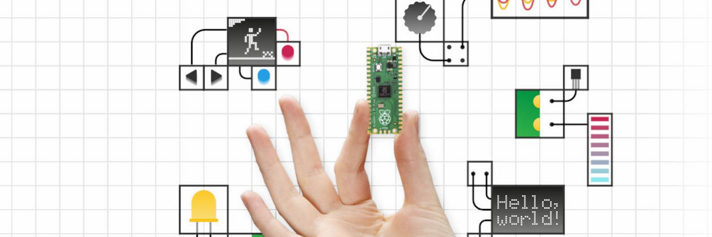

# Utilidades Raspberry Pi




[Inicio de sección](#Header) &nbsp; &nbsp; - &nbsp; &nbsp; [Índice](#índice)
<br><br>

# Índice
1. [Actualizar eeprom]()
2. [Reducir imagen de MicroSD](#reducir-imagen-de-microsd)
3. [Añadir un disco duro externo a una Raspberry Pi](#añadir-un-disco-duro-externo-a-una-raspberry-pi)
4. []()

[<< Raspberry Pi >>](./raspberrypi.md)<br>
[Índice](#índice) &nbsp; &nbsp; - &nbsp; &nbsp;[Arriba](#header)
<br><br>

[Inicio de sección](#añadir-un-disco-duro-externo-a-una-raspberry-pi) &nbsp; &nbsp; - &nbsp; &nbsp; [Índice](#índice) &nbsp; &nbsp; - &nbsp; &nbsp;[Arriba](#header)
<br><br>

# Flashear eeprom

```bash

# Actualizar Raspbian
sudo apt-get -y update && sudo apt-get -y upgrade

# Instalar rpi-eeprom y rpi-eeprom-images
sudo apt-get -y install rpi-eeprom rpi-eeprom-images 

# Reiniciar Raspbian para que al iniciar cargue el nuevo firmware
sudo shutdown -r now

# Comprobar versión de Firmware
sudo rpi-eeprom-update
```
[Inicio de sección](#flashear-eeprom) &nbsp; &nbsp; - &nbsp; &nbsp; [Índice](#índice) &nbsp; &nbsp; - &nbsp; &nbsp;[Arriba](#header)
<br><br>

# [Reducir imagen de MicroSD](https://github.com/Drewsif/PiShrink/blob/master/README.md)
**PiShrink** es un script de bash diseñado para reducir automáticamente imágenes de **Raspberry Pi**, permitiendo que se ajusten al tamaño máximo de una tarjeta SD al arrancar. Esta herramienta acelera el proceso de restauración de imágenes en tarjetas SD y garantiza una mejor compresión de las imágenes reducidas. Además, ofrece la opción de comprimir la imagen reducida utilizando gzip y xz, lo que resulta en un tamaño aún más pequeño. **PiShrink** también es compatible con la compresión paralela de imágenes utilizando múltiples núcleos del procesador.

## Opciones
```
uso: $0 [-adhrsvzZ] imagefile.img [newimagefile.img]
  -s  No expandir el sistema de archivos cuando la imagen se inicia por primera vez
  -v  Activar 'verbose'
  -r  Usar opción avanzada de reparación del sistema de archivos si falla la normal
  -z  Comprimir imagen con gzip después de reducirla
  -Z  Comprimir imagen con xz después de reducirla
  -a  Comprimir imagen en paralelo usando múltiples núcleos
  -d  Escribir mensajes de depuración en un archivo de registro de depuración
```

Si especificas el parámetro `newimagefile.img`, el script hará una copia de `imagefile.img` y trabajará a partir de esa copia. Necesitarás suficiente espacio para hacer una copia completa de la imagen para usar esa opción.

* `-s` evita la expansión automática del sistema de archivos en el próximo arranque de la imagen
* `-v` habilita una salida más detallada
* `-r` intentará reparar el sistema de archivos utilizando opciones adicionales si la reparación normal falla
* `-z` comprimirá la imagen después de reducirla usando gzip. Se agregará la extensión `.gz` al nombre del archivo.
* `-Z` comprimirá la imagen después de reducirla usando xz. Se agregará la extensión `.xz` al nombre del archivo.
* `-a` utilizará la opción -f9 para pigz y la opción -T0 para xz y comprimirá en paralelo.
* `-d` creará un archivo de registro `pishrink.log` que puede ayudar para el análisis de problemas.

Las opciones predeterminadas para los compresores pueden ser sobrescritas definiendo las variables de entorno PISHRINK_GZIP o PSHRINK_XZ para gzip y xz.

## Prerequisitos
Si estás ejecutando PiShrink en VirtualBox, es probable que encuentres un error si intentas usar la función de "Carpeta compartida" de VirtualBox. Puedes copiar la imagen que deseas reducir en la máquina virtual desde una Carpeta compartida, pero se sabe que reducir directamente desde la Carpeta compartida causa problemas.

Si estás utilizando Ubuntu, es probable que veas un error sobre `e2fsck` estando desactualizado y `metadata_csum`. La solución más sencilla para esto es usar Ubuntu 16.10 o superior, ya que te ahorrará muchos problemas a largo plazo.

## Instalación

```bash
wget https://raw.githubusercontent.com/Drewsif/PiShrink/master/pishrink.sh
chmod +x pishrink.sh
sudo mv pishrink.sh /usr/local/bin
```

## Modo de uso

```bash
[user@localhost PiShrink]$ sudo pishrink.sh pi.img
e2fsck 1.42.9 (28-Dec-2013)
Pass 1: Checking inodes, blocks, and sizes
Pass 2: Checking directory structure
Pass 3: Checking directory connectivity
Pass 4: Checking reference counts
Pass 5: Checking group summary information
/dev/loop1: 88262/1929536 files (0.2% non-contiguous), 842728/7717632 blocks
resize2fs 1.42.9 (28-Dec-2013)
resize2fs 1.42.9 (28-Dec-2013)
Resizing the filesystem on /dev/loop1 to 773603 (4k) blocks.
Begin pass 2 (max = 100387)
Relocating blocks             XXXXXXXXXXXXXXXXXXXXXXXXXXXXXXXXXXXXXXXX
Begin pass 3 (max = 236)
Scanning inode table          XXXXXXXXXXXXXXXXXXXXXXXXXXXXXXXXXXXXXXXX
Begin pass 4 (max = 7348)
Updating inode references     XXXXXXXXXXXXXXXXXXXXXXXXXXXXXXXXXXXXXXXX
The filesystem on /dev/loop1 is now 773603 blocks long.

Shrunk pi.img from 30G to 3.1G
```

[Inicio de sección](#instalación) &nbsp; &nbsp; - &nbsp; &nbsp; [Índice](#índice) &nbsp; &nbsp; - &nbsp; &nbsp;[Arriba](#utilidades-raspberry-pi)
<br><br>

# Añadir un disco duro externo a una Raspberry Pi
Los discos duros externos comúnmente utilizan sistemas de archivos NTFS o FAT. NTFS ofrece mejor rendimiento, pero la solución ideal para GNU/Linux es formatearlos con ext4.

## Comprobar la información del disco
Para verificar la información del disco externo conectado a la Raspberry Pi, sigue estos pasos:

```bash
lsblk -fm
```
* `lsblk` informa sobre los dispositivos de almacenamiento.
* `-f` informa sobre los sistemas de archivos instalados.
* `-m` informa sobre quién es su propietario, su tamaño, etc.

Desmontar las particiones, por ejemplo:
```bash
sudo umount /dev/sdb1
```

## Opción corta

```bash
# Paso 1: Crear los puntos de montaje
sudo mkdir -p /media/backup

# Paso 2: Montar las unidades
sudo mount /dev/sda1 /media/backup

# Paso 3: Puedes comprobar que todo ha ido bien usando
lsblk -fm.


# Recuerda desmontar las unidades antes de desconectarlas
sudo umount /mnt/sda
```

## Opción larga

### Formatear en `ext4`
Aunque no es obligatorio, es muy recomendable, ***si no te importa perder la información que tienes en el HDD***. Ya que `ext4` es un sistema de archivos nativo de linux.

Si no estás seguro de lo que haces, o no quieres perder la información, salta te este paso y continúa con *[establecer un punto de montaje](#establecer-un-punto-de-montaje)*

```bash
## ¡¡OJO!! este procedimiento borra el contenido de tu HDD

# Paso 1: Damos formato al disco en ext4:
sudo mkfs.ext4 /dev/sdb1

# Al recibir un aviso en inglés, responde "s" para continuar.
# Al completarse obtendremos el UUID asignado al volumen.
```

### Establecer un punto de montaje
Para integrar el disco permanentemente en la estructura de archivos del sistema operativo, sigue estos pasos:

```bash
# Paso 1: Crea una carpeta vacía que actuará como punto de montaje para el disco. Para montar unidades se suele usar la ruta '/mnt' o '/media/
sudo mkdir -p /media/backup

# Paso 2: Obtener el UUID del disco
lsblk -fm

# Paso 3 (opcional): Si quieres que el hdd se monte automáticamente al arranque del sistema, añade al final del archivo 'fstab' la siguiente información con el formato indicado (usa el UUID de tu disco y la ruta de la carpeta que has creado en el paso anterior):
sudo vim /etc/fstab

UUID=5acb11f9-a5e9-49c3-a225-a872fc688f22 /media/backup ext4 defaults 0 0
```

### Comprobar que todo funciona
Después de seguir los pasos anteriores, solo queda asegurarse de que todo funciona correctamente. Esto se hace reiniciando el equipo con el siguiente comando:

```bash
sudo reboot
lsblk -fm
```
Si todo está bien, la carpeta que creamos se utilizará como punto de montaje para el disco nuevo.

### Último Detalle: Modificación de Permisos
Esto otorga permisos de lectura y escritura sobre la carpeta, y por ende sobre el disco, a todas las cuentas de usuario de la Raspberry Pi.
```bash
sudo chmod 766 /media/backup
```

[Inicio de sección](#añadir-un-disco-duro-externo-a-una-raspberry-pi) &nbsp; &nbsp; - &nbsp; &nbsp; [Índice](#índice) &nbsp; &nbsp; - &nbsp; &nbsp;[Arriba](#header)
<br><br>

# Sección 1


[Inicio de sección](#sección-1) &nbsp; &nbsp; - &nbsp; &nbsp; [Índice](#índice) &nbsp; &nbsp; - &nbsp; &nbsp;[Arriba](#header)
<br><br>