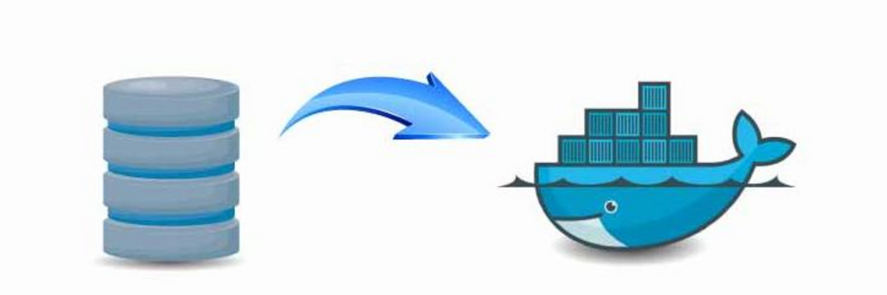

---
authors:
  - Carmelo Molero Castillo
date: 2025-03-19
---

# Volúmenes en Docker



Los volúmenes en Docker son un mecanismo para persistir datos generados por contenedores, permitiendo que estos datos sobrevivan a la terminación o eliminación de los contenedores que los crearon. También facilitan el intercambio de datos entre contenedores o entre el host y los contenedores de Docker.

Los volúmenes en Docker son esenciales para manejar datos persistentes y compartirlos entre contenedores y el host. Proporcionan flexibilidad, portabilidad y facilitan la gestión de datos en entornos de contenedores.

## ¿Por qué usar volúmenes en Docker?

- **Persistencia de Datos:** Permiten que los datos persistan más allá del ciclo de vida de un contenedor, lo cual es esencial para bases de datos, archivos de configuración o registros.
- **Compartir Datos entre Contenedores:** Facilitan el intercambio de datos entre múltiples contenedores, útil en aplicaciones distribuidas o microservicios.
- **Aislamiento y Portabilidad:** Permiten aislar los datos del contenedor, facilitando la migración entre entornos de desarrollo, pruebas y producción.

## Tipos de Volúmenes en Docker

Docker ofrece diferentes tipos de volúmenes para distintas necesidades:

1. **Volúmenes de Docker:** Son directorios creados y gestionados por Docker. Se almacenan en la ubicación predeterminada del sistema de archivos del host.
2. **Bind Mounts:** Permiten montar un directorio o archivo específico del sistema de archivos del host en un contenedor, proporcionando más control sobre la ubicación de los datos.
3. **tmpfs Mounts:** Se almacenan en memoria y no persisten tras el reinicio del contenedor.

## Gestión de Volúmenes en Docker

### Crear un volumen
```bash
docker volume create mi_volumen
```

### Listar volúmenes existentes
```bash
docker volume ls
```

### Inspeccionar un volumen
```bash
docker volume inspect mi_volumen
```

### Eliminar un volumen
```bash
docker volume rm mi_volumen
```

## Backup y Restauración de Volúmenes en Docker

Los volúmenes pueden ser respaldados y restaurados fácilmente mediante contenedores temporales.

### Hacer Backup de un Volumen
```bash
# Variables
nombre_del_volumen="mi_volumen"
ruta_destino_backup="/ruta/destino/backup"

# 1. Detener los contenedores asociados
docker-compose stop

# 2. Crear un directorio para el backup si no existe
mkdir -p $ruta_destino_backup

# 3. Crear un archivo de respaldo del volumen
docker run --rm -v $nombre_del_volumen:/data -v $ruta_destino_backup:/backup busybox tar czf /backup/$nombre_del_volumen.tar.gz /data
```

### Restaurar un Backup de Volumen
```bash
# Variables
nombre_del_volumen="mi_volumen"
ruta_origen_backup="/ruta/origen/backup"

# 1. Detener los contenedores asociados
docker-compose stop

# 2. Importar el volumen desde el archivo de respaldo
docker run --rm -v $nombre_del_volumen:/data -v $ruta_origen_backup:/backup busybox tar xzf /backup/$nombre_del_volumen.tar.gz -C /data
```

