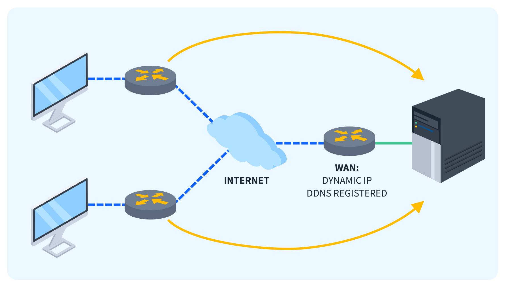

# Guía de DDNS



**Descripción**:  
El Dynamic Domain Name System (DDNS) es un servicio que permite actualizar automáticamente los registros DNS para dominios en tiempo real. Esto es útil cuando se tiene una dirección IP dinámica (como las proporcionadas por la mayoría de los proveedores de Internet) y se quiere acceder a una red o servicio utilizando un nombre de dominio constante.  

A continuación, se explican los pasos para configurar DDNS tanto en un router compatible como en un sistema sin soporte directo.

---

## Instalación

### Requisitos previos

- Un router compatible con DDNS o un dispositivo de red (como un Raspberry Pi o un servidor Linux) para realizar la configuración.
- Una cuenta en un servicio de DDNS (por ejemplo, No-IP, DynDNS, DuckDNS).
- Acceso a la interfaz de administración de tu router o sistema Linux.

### Instalación en Linux 

1. **Instalar herramientas necesarias**  
   Si deseas configurar DDNS en un sistema Linux (por ejemplo, un servidor o una Raspberry Pi), necesitarás una herramienta como `ddclient`, que se encarga de actualizar el servidor de DDNS con la nueva dirección IP.

   Para instalar `ddclient` en una distribución basada en Debian (como Ubuntu), ejecuta:
   ```bash
   sudo apt update
   sudo apt install ddclient
   ```

2. **Configurar `ddclient`**  
   Durante la instalación, se te pedirá configurar el servicio DDNS. Si no se te solicita automáticamente, puedes editar el archivo de configuración directamente.

   Edita el archivo de configuración:
   ```bash
   sudo nano /etc/ddclient.conf
   ```

   Ejemplo de configuración:
   ```ini
   protocol=dyndns2
   use=web
   server=members.dyndns.org
   login=tu_usuario_ddns
   password='tu_contraseña_ddns'
   tu_dominio.dyndns.org
   ```

   Reemplaza `tu_usuario_ddns`, `tu_contraseña_ddns` y `tu_dominio.dyndns.org` con los datos proporcionados por el servicio de DDNS que hayas contratado.

3. **Iniciar y habilitar el servicio `ddclient`**  
   Para que DDNS funcione de manera continua, necesitas iniciar el servicio y asegurarte de que se ejecute al iniciar el sistema:
   ```bash
   sudo systemctl enable ddclient
   sudo systemctl start ddclient
   ```

4. **Verificar el funcionamiento**  
   Puedes verificar si el servicio está funcionando correctamente con el siguiente comando:
   ```bash
   sudo systemctl status ddclient
   ```

---

## Uso de SSH

Para administrar tu servidor Linux con DDNS, puedes utilizar SSH para conectarte de manera remota y gestionar la configuración o solucionar problemas.

1. **Conexión SSH**  
   Si has configurado correctamente DDNS, puedes acceder a tu servidor de forma remota con el nombre de dominio en lugar de la dirección IP.

   Ejemplo de conexión SSH:
   ```bash
   ssh usuario@tu_dominio.dyndns.org
   ```

---

## Configuración Básica

### Configuración en un Router Compatible

1. **Acceder al Router**  
   En primer lugar, accede a la interfaz de administración de tu router. Usualmente, puedes hacerlo ingresando la dirección IP del router en tu navegador, como `192.168.1.1` o `192.168.0.1`.

2. **Buscar la opción de DDNS**  
   En el panel de configuración del router, busca la sección de **DDNS** (generalmente bajo "Red" o "Avanzado").

3. **Configurar DDNS**  
   Ingresa los datos del servicio DDNS que hayas contratado:
   - **Proveedor de DDNS**: Selecciona el servicio que estás utilizando (por ejemplo, No-IP, DynDNS, DuckDNS).
   - **Usuario y contraseña**: Ingresa los datos de acceso de tu cuenta de DDNS.
   - **Dominio**: Especifica el dominio que has registrado.

4. **Guardar y aplicar cambios**  
   Una vez que hayas ingresado todos los datos, guarda la configuración. El router comenzará a actualizar automáticamente la dirección IP en el servicio de DDNS cada vez que cambie.

---

## Configuración Avanzada

### Uso de Scripts para Actualización Manual

Si tu router no soporta DDNS o prefieres usar un dispositivo adicional, puedes configurar un script para actualizar manualmente tu dirección IP en el servicio DDNS.

1. **Crear un script de actualización**  
   Puedes crear un simple script de shell que haga uso de `curl` para actualizar tu IP:
   ```bash
   #!/bin/bash
   curl -u usuario:contraseña "http://dynupdate.no-ip.com/nic/update?hostname=tu_dominio.dyndns.org"
   ```

2. **Programar la actualización automática**  
   Utiliza `cron` para ejecutar el script de manera periódica:
   ```bash
   crontab -e
   ```
   Agrega la siguiente línea para ejecutar el script cada 30 minutos:
   ```bash
   */30 * * * * /ruta/a/tu/script.sh
   ```

---

## Solución de Problemas

**Error: "No se puede actualizar la IP en el servicio DDNS"**  
🔹 Solución: Asegúrate de que las credenciales (usuario y contraseña) en la configuración de DDNS estén correctas. Verifica también que el servicio de DDNS esté en funcionamiento y que la dirección IP de tu red local sea accesible desde Internet.

**Error: "El router no soporta DDNS"**  
🔹 Solución: Si tu router no tiene soporte para DDNS, considera usar un dispositivo de red (como un Raspberry Pi o un servidor Linux) para manejar la actualización del DNS. Utiliza la herramienta `ddclient` como se describe en la sección de instalación en Linux.

**Error: "El dominio no se actualiza correctamente"**  
🔹 Solución: Verifica si el servicio de DDNS tiene alguna limitación en la frecuencia de actualizaciones. Algunos servicios requieren que la actualización de IP se haga solo una vez cada cierto tiempo. Revisa la documentación del servicio DDNS.

---