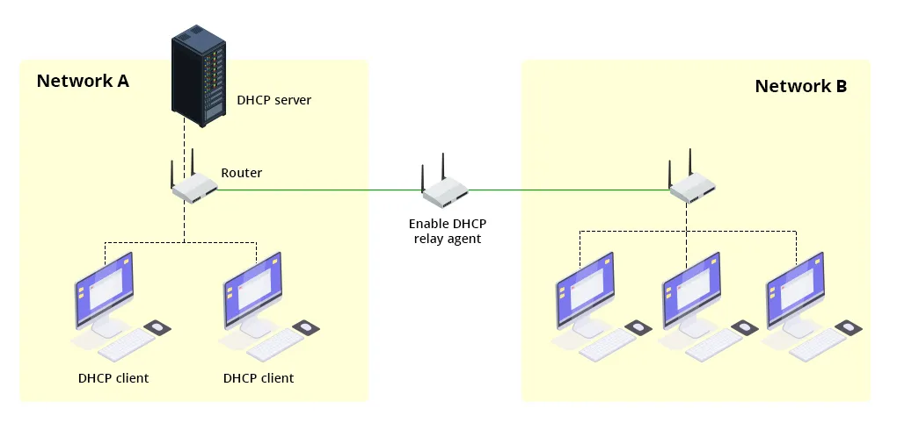

# Guía de DHCP

  

**Descripción**:  
DHCP (Dynamic Host Configuration Protocol) es un protocolo de red utilizado para asignar automáticamente direcciones IP y otros parámetros de configuración de red a dispositivos. Su uso simplifica la administración de redes al evitar configuraciones manuales y errores humanos.

**Características principales**:  
- ✅ **Asignación Dinámica de IPs** - Permite a los dispositivos obtener direcciones IP automáticamente.  
- ✅ **Reducción de Errores** - Evita conflictos de direcciones IP y configuraciones incorrectas.  
- ✅ **Escalabilidad** - Facilita la gestión de redes grandes al automatizar la asignación de configuraciones.

💡 *Consejo*: En redes grandes, el uso de DHCP centralizado optimiza la administración y la seguridad.

---

## Instalación

Antes de instalar el servicio DHCP, asegúrate de cumplir con los **requisitos previos**.

### Requisitos previos
- 📌 **Sistema operativo compatible**: Linux (Debian, Ubuntu, CentOS, etc.).
- 📌 **Dependencias**: Se recomienda tener privilegios de administrador.
- 📌 **Acceso**: Se requieren permisos de sudo para la instalación y configuración.

### Instalación en Linux

Ejecuta los siguientes comandos en la terminal:

```bash
# Verificar si DHCP está instalado
$ dpkg -l | grep dhcpcd

# Si no está instalado, instalar DHCP
$ sudo apt-get update
$ sudo apt-get install dhcpcd5

# Habilitar y comenzar el servicio DHCP
$ sudo systemctl enable dhcpcd
$ sudo systemctl start dhcpcd

# Verificar el estado del servicio
$ service dhcpcd status
```

---

## Uso

Una vez instalado, el servicio DHCP asignará direcciones IP automáticamente. Para configurar el servicio según necesidades específicas, edita su archivo de configuración.

```bash
$ sudo vim /etc/dhcpcd.conf
```

Ejemplo de configuración manual de una dirección IP fija:
```plaintext
interface eth0
static ip_address=192.168.1.100/24
static routers=192.168.1.1
static domain_name_servers=8.8.8.8 8.8.4.4
```

💡 *Para redes grandes, usa un servidor DHCP centralizado para una gestión más eficiente.*

---

## Solución de Problemas

**Error 1: El servicio DHCP no inicia**  
Solución: Verifica los logs con:
```bash
journalctl -xe | grep dhcpcd
```

**Error 2: No se asignan direcciones IP**  
Solución: Asegúrate de que no haya conflictos con otros servidores DHCP en la red.
```bash
sudo systemctl restart dhcpcd
```

💡 *Para depuraciones avanzadas, revisa `/var/log/syslog`.*

