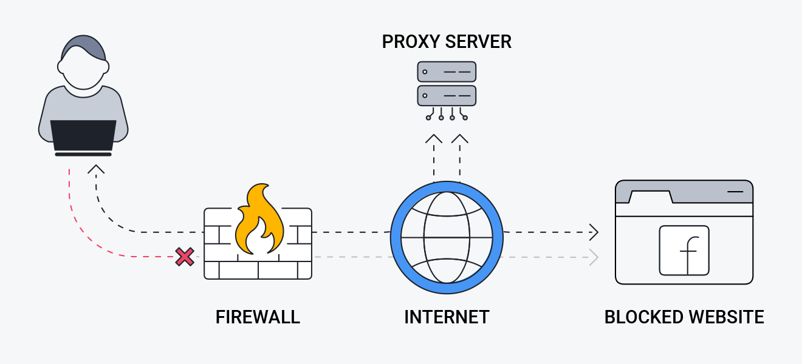

# Proxy vs Proxy Inverso



**Descripción**:  
Los proxies son herramientas que actúan como intermediarios entre dispositivos en una red. Existen dos tipos principales: el **proxy directo** (o simplemente “proxy”) y el **proxy inverso**. Aunque su función principal es intermediar entre peticiones y respuestas, se usan en contextos muy distintos.

---

## Proxy (Directo)

Un **proxy directo** se sitúa entre un cliente (como un navegador) y el servidor al que quiere acceder. Es común en redes corporativas, bibliotecas o usuarios que desean privacidad.

**Funciones principales**:
- ✅ **Anonimato** - Oculta la IP del cliente.
- ✅ **Filtrado de contenido** - Restringe el acceso a sitios web.
- ✅ **Cacheo** - Almacena respuestas para acelerar el acceso a recursos.
- ✅ **Bypass geográfico** - Permite acceder a contenido bloqueado por región.

### Esquema de Proxy Directo (Forward Proxy)  
📌 El proxy actúa en nombre del **cliente** y decide si permite la conexión.  
```
        [Cliente A]         [Cliente B]         [Cliente C]
            |                   |                   |
            |                   |                   |
            +-------------------+-------------------+
                                |
                                v
                      +--------------------+
                      |   FORWARD PROXY    |  ← Oculta a los clientes
                      +--------------------+
                                |
                                v
                 +-----------------------------+
                 |       Internet / Web        |
                 |     (Servidor destino)      |
                 +-----------------------------+
```

### Ejemplos de uso
- Un empleado accede a Internet mediante un proxy corporativo que filtra sitios no permitidos.
- Un usuario usa un proxy para navegar como si estuviera en otro país.

---

## Proxy Inverso

Un **proxy inverso** se ubica entre los clientes externos e **infraestructura interna** (como servidores de aplicaciones o microservicios). Los clientes no ven directamente los servidores reales.

**Funciones principales**:
- ✅ **Balanceo de carga** - Distribuye tráfico entre múltiples servidores.
- ✅ **Seguridad** - Oculta la topología de la red interna.
- ✅ **Terminación SSL** - Maneja certificados TLS para simplificar servidores backend.
- ✅ **Caché y compresión** - Reduce la carga en los servidores.

### Esquema de Proxy Inverso (Reverse Proxy)  
📌 El proxy actúa en nombre del **servidor**, distribuyendo o filtrando peticiones.  
```
                  +-------------------------+
                  |   Usuarios / Clientes   |
                  +-------------------------+
                               |
                               v
                   +-----------------------+
                   |      REVERSE PROXY    | ← Oculta a los servidores
                   +-----------------------+
                  /           |             \
                 v            v              v
          [Servidor A]   [Servidor B]   [Servidor C]
        (App, API, Web) (App, API, Web) (App, API, Web)
```

### Ejemplos de uso
- Un servidor NGINX redirige el tráfico a diferentes microservicios según la ruta solicitada.
- Un proxy inverso maneja certificados SSL centralizados para varios servidores web.

---

## Comparación rápida

| Característica        | Proxy (Directo)                  | Proxy Inverso                      |
|----------------------|----------------------------------|------------------------------------|
| Intermediario entre  | Cliente y servidor externo       | Cliente y servidores internos      |
| Visibilidad externa  | Oculta al cliente                | Oculta a los servidores            |
| Ubicación típica     | En la red del cliente            | En la red del servidor             |
| Propósito principal  | Privacidad, filtrado, caché      | Seguridad, balanceo, gestión SSL   |
| Herramientas comunes | Squid, TOR, Privoxy              | Nginx, HAProxy, Apache HTTPD       |

---

## Casos prácticos

### 🧭 Caso 1: Uso de Proxy

```bash
# Configurar proxy en navegador para navegar con IP de otro país
```

Ideal para navegar anónimamente o acceder a contenido con bloqueo geográfico.

---

### 🧭 Caso 2: Uso de Proxy Inverso con NGINX

```nginx
server {
    listen 80;
    server_name ejemplo.com;

    location / {
        proxy_pass http://localhost:3000;
    }
}
```

Este archivo de configuración redirige todas las peticiones HTTP a una aplicación Node.js en el puerto 3000.

---

## Conclusión

Tanto el proxy como el proxy inverso son herramientas esenciales en el diseño de redes modernas. Cada uno cumple funciones distintas dependiendo de si se busca controlar el acceso desde el cliente o gestionar el tráfico hacia los servidores. Entender sus diferencias es clave para construir sistemas seguros, escalables y eficientes.

