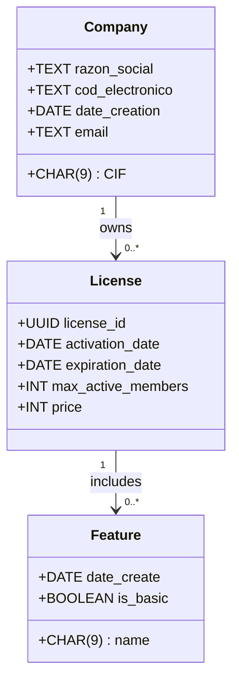

# 📌 Diagrama de Clases  

El siguiente diagrama de clases representa la estructura del sistema y las relaciones entre sus componentes principales.

---

[🔙 Volver al índice del proyecto](../index.md) 

---