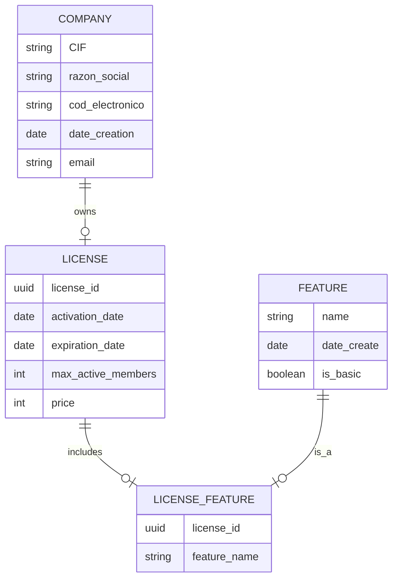

# 📌 Diagrama Entidad-Relación (DER)

Este diagrama muestra la estructura de la base de datos y cómo las entidades están relacionadas.

```mermaid
erDiagram
    COMPANY {
        string CIF
        string razon_social
        string cod_electronico
        date date_creation
        string email
    }
    LICENSE {
        uuid license_id
        date activation_date
        date expiration_date
        int max_active_members
        int price
    }
    FEATURE {
        string name
        date date_create
        boolean is_basic
    }
    LICENSE_FEATURE {
        uuid license_id
        string feature_name
    }

    COMPANY ||--o| LICENSE : owns
    LICENSE ||--o| LICENSE_FEATURE : includes
    FEATURE ||--o| LICENSE_FEATURE : is_a
```

---

[🔙 Volver al índice del proyecto](../index.md) 

---