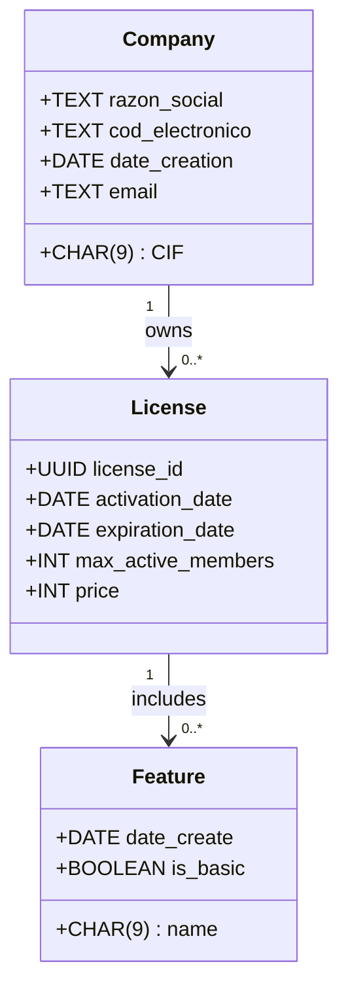

# 🚀 License Manager - Generador y Gestor de Licencias

---

## 📖 **Descripción General**  
**License Manager** es una aplicación de escritorio desarrollada en Python que permite **generar**, **renovar** y **gestionar** licencias para otro software. Utiliza una base de datos SQLite para almacenar la información sobre las licencias, las empresas, y las funcionalidades habilitadas en cada licencia.

Este software permite crear licencias personalizadas, asociarlas a una empresa y generar un archivo **JSON encriptado** con la información de la licencia. Las licencias contienen información como la **fecha de activación**, **expiración**, y las **funcionalidades disponibles**. Además, están protegidas mediante un sistema de **encriptación con clave pública y clave privada**.

---

## 🎯 **Objetivos**  
- ✅ **Generación y gestión de licencias:** Crear, renovar y eliminar licencias con información cifrada.  
- ✅ **Integración con base de datos SQLite:** Almacenar licencias, empresas y características asociadas de manera eficiente.  
- ✅ **Encriptación y seguridad:** Proteger las licencias mediante un sistema de cifrado con claves públicas y privadas.  

---

## 📚 **Épicas**  

- 🏗 [EP-001 - Generar Licencia](./epic/EP-001-generar_licencia.md)  
- 🏗 [EP-002 - Comprobar Validez de una Licencia](./epic/EP-002-comprobar_validez_licencia.md)  
- 🏗 [EP-003 - Renovar Licencia](./epic/EP-003-renovar_licencia.md)  

---

## 🏛️ **Arquitectura del Sistema**  

---

## 🛠 **Tecnologías Utilizadas**  
- 🖥 **Backend:** Python (con librerías como `PyCryptodome` para encriptación y `SQLite3` para la base de datos).  
- 🎨 **Frontend:** Tkinter (si se va a utilizar una interfaz gráfica de usuario).  
- 🗄 **Base de datos:** SQLite (estructura de tablas para almacenar información sobre licencias, empresas y características).  
- ☁️ **Infraestructura:** No se requiere infraestructura en la nube, ya que el sistema es autónomo y basado en un escritorio local.  

---

## 📦 **Repositorio del Código**  
🔗 [Enlace al repositorio en GitHub](https://github.com/usuario/repositorio)  

---

## 📊 **Diagramas del Sistema**

- 🖼️ [Diagrama de Clases](diagramas/diagrama_clases.md)
- 🖼️ [Diagrama Entidad-Relación](diagramas/diagrama_er.md)

---

## 👥 **Actores del Sistema**
- 👤 [Actores](actores.md)

---

## 🗂️ **Secciones**
- 📂 [Secciones de la Aplicación](secciones.md)

