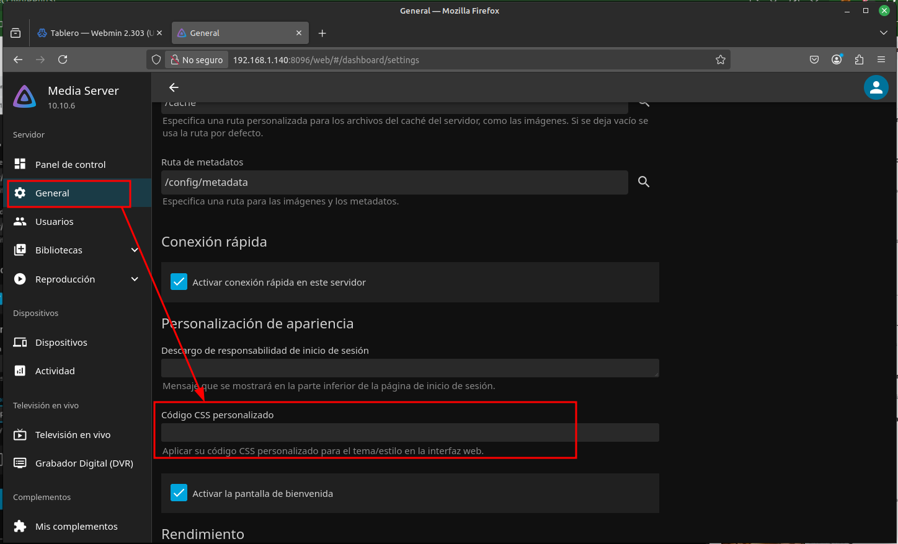
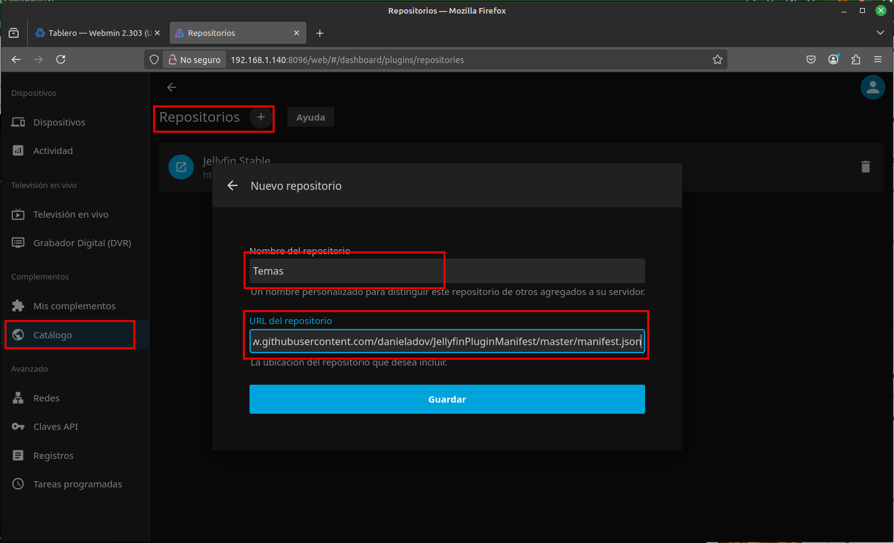
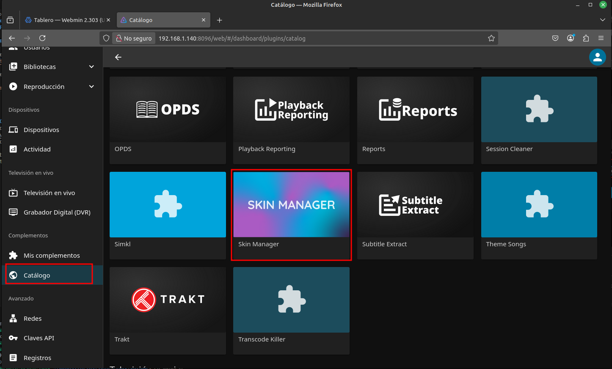
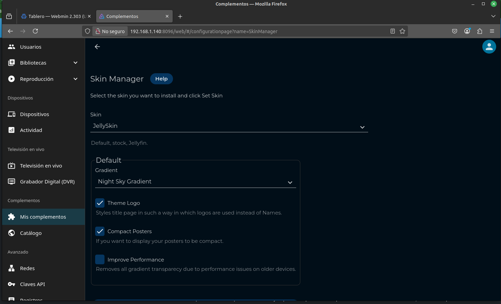

# Jellyfin


**Jellyfin** es una plataforma de código abierto para la gestión y transmisión de medios digitales, como películas, series, música y programas de televisión, que permite a los usuarios organizar, acceder y compartir su contenido multimedia desde cualquier dispositivo. 

A diferencia de otros servicios de transmisión como Plex, Jellyfin no requiere suscripciones ni servicios en la nube, ya que funciona completamente de forma local y es completamente gratuito. Con una interfaz intuitiva y soporte para múltiples usuarios y dispositivos.

**Jellyfin** se basa en la versión 3.5.2 de Emby y ha sido adaptado al framework .NET Core para ofrecer soporte multiplataforma completo. No requiere licencias premium ni características ocultas: es un proyecto colaborativo que busca mejorar y avanzar en conjunto.

**Jellyfin** es ideal para quienes desean tener control total sobre su biblioteca multimedia sin recurrir a soluciones comerciales.

🔹 **Página oficial**: [https://jellyfin.org/](https://jellyfin.org/)

---

## Instalación

Todos los ficheros relacionados con nuestra instalación de **Jellyfin** se alojarán dentro de un directorio ubicado en `~/docker`, a fin de tener organizado nuestro sistema de ficheros.

### Paso 1: Crear la estructura de directorios

Para comenzar, crea la estructura de directorios necesaria en tu sistema:

```bash
$ mkdir -p ~/docker/jellyfin/volume/{cache,config}
$ sudo mkdir -p /mnt/server
$ sudo chown $(whoami):$(whoami) /mnt/server 
```

### Paso 2: Crear el archivo `docker-compose.yml`

Luego, crea y edita el archivo `docker-compose.yml` en el directorio correspondiente:

```bash
$ vim ~/docker/jellyfin/docker-compose.yml
```

### Paso 3: Estructura de directorios esperada

Antes de iniciar el contenedor, la estructura del sistema de ficheros debería quedar organizada de la siguiente manera:

```bash
$ tree ~

~/docker/jellyfin
├── docker-compose.yml
└── volume
    ├── cache
    └── config

/
├── ...
├── mnt
│   └── server
└── ...
```

---

## Despliegue de `docker-compose.yml`

Para desplegar el contenedor de **Jellyfin**, puedes hacerlo tanto desde **Portainer** como desde la línea de comandos usando Docker Compose. Si optas por la segunda opción, ejecuta el siguiente comando para levantar el contenedor:

```bash
$ docker-compose up -d

# Puedes 'bajar' el contenedor mediante
$ docker-compose down

# Puedes ver la salida de log usando
$ docker logs -f <ID_CONTENEDOR>
```

### Contenido del archivo `docker-compose.yml`

Este es el contenido del archivo `docker-compose.yml` que necesitas para configurar tu contenedor de **Jellyfin**:

```yaml
services:

  # ================== Jellyfin
  jellyfin:
    image: jellyfin/jellyfin
    container_name: jellyfin      # Nombre del contenedor
    restart: unless-stopped       # Política de reinicio del contenedor

    environment:
      TZ: Europe/Madrid           # Zona horaria
      PUID: 1000                  # ID de usuario en el host
      PGID: 1000                  # ID de grupo en el host
      #JELLYFIN_PublishedServerUrl: 192.168.0.5  # Optional: alternative address used for autodiscovery

    volumes:
      - config:/config            # Volumen para la configuración de Jellyfin
      - data:/data                # Volumen para los datos

    ports:
      - "8096:8096"               # Puerto para la interfaz web
      - "8920:8920"               # Puerto opcional para HTTPS
      - "7359:7359/udp"           # Puerto opcional para auto-detección
      - "1900:1900/udp"           # Puerto opcional para DLNA

    extra_hosts:
      - 'host.docker.internal:host-gateway'  # Host adicional para la red interna del contenedor

volumes:
  config:                         # Volumen para la configuración de Jellyfin
    driver_opts:
      type: none
      device: ~/docker/jellyfin/volume/config
      o: bind

  data:                       # Volumen para los datos
    driver_opts:
      type: none
      device: /mnt/server
      o: bind
```

---

## Acceso

Una vez que el contenedor esté desplegado y funcionando, podrás acceder a la interfaz web de **Jellyfin** a través de tu navegador. Simplemente ingresa la siguiente URL en la barra de direcciones:

```
http://ip-server:8096
```

Sustituye `ip-server` por la IP de tu dispositivo.

---

## Personalización

### Cambiar apariencia

#### Opción 1: Importando CSS

Se pueden buscar por la web distintos estilos como este de [prayag17](https://github.com/prayag17/JellySkin) que tiene una apariencia similar al NetFlix.  
Se debe configurar importando el enlace aquí:



#### Opción 2: Administrando el plugin **skin-manager**

Necesitaremos pegar este enlace `https://raw.githubusercontent.com/danieladov/JellyfinPluginManifest/master/manifest.json`

1. Agregar un nuevo repositorio en `Dashboard / Catálogo / Ajustes ⚙️ / Repositorio ➕`
    

2. Instalamos el nuevo repositorio, que ya se ha tenido que insertar
    

3. Reiniciamos el servidor (con reiniciar el contenedor docker es suficiente)

4. Nos vamos a `Dashboard / Skin Manager` y elegimos el skin que más nos guste
    

### Cambiar Nombre de la pestaña


---

## Configuración de la biblioteca
Puedes ver la configuración de medios en la [documentación oficial](https://jellyfin.org/docs/general/server/devices). Aunque aquí muestro la estructura base que debes tener en los HDD's para que sea reconocible.

```bash
/mnt/server
    ├── Books
    │   ├── Audiobooks
    │   │   ├── Author
    │   │   │   ├── Book1.flac
    │   │   │   └── Book2.flac
    │   │   └── Book
    │   │       ├── Chapter1.flac
    │   │       └── Chapter2.~~flac~~
    │   └── ~~Books~~
    │       └── Author
    │           ├── Book1.epub
    │           ├── Book2.epub
    │           ├── Book
    │           │   ├── Book1.epub
    │           │   ├── cover.ext
    │           │   └── metadata.opf
    │           └── Book3.mp3
    ├── Comics
    │   ├── Plastic Man #002 (1944).cbz
    │   ├── Attack on Titan #001 (2012).cbz
    │   └── Comic (2008)
    │       ├── ComicInfo.xml
    │       └── Comic #001 (2008).cbr
    ├── Movies
    │   ├── Film (1990).mp4
    │   ├── Film (1994).mp4
    │   ├── Film (2008)
    │   │   └── Film.mkv
    │   └── Film (2010)
    │   │   ├── Film-cd1.avi
    │   │   └── Film-cd2.avi
    │   ├── Best_Movie_Ever (2019)
    │   │   ├── Best_Movie_Ever (2019) - 1080P.mp4
    │   │   ├── Best_Movie_Ever (2019) - 720P.mp4
    │   │   └── Best_Movie_Ever (2019) - Directors Cut.mp4
    │   └── Movie (2021) [imdbid-tt12801262]
    │       ├── Movie (2021) [imdbid-tt12801262] - 2160p.mp4
    │       ├── Movie (2021) [imdbid-tt12801262] - 1080p.mp4
    │       └── Movie (2021) [imdbid-tt12801262] - Directors Cut.mp4
    ├── Music
    │   ├── Some Artist
    │   │   ├── Album A
    │   │   │   ├── Song 1.flac
    │   │   │   ├── Song 2.flac
    │   │   │   └── Song 3.flac
    │   │   └── Album B
    │   │       ├── Track 1.m4a
    │   │       ├── Track 2.m4a
    │   │       └── Track 3.m4a
    │   └── Album X
    │       ├── Disc 1 Track 1.ogg
    │       ├── Disc 1 Track 2.ogg
    │       ├── Disc 2 Track 1.ogg
    │       ├── Disc 3 Track 1.ogg
    │       ├── Disc 3 Track 2.ogg
    │       └── Disc 3 Track 3.ogg
    └── Shows
        ├── Series Name A (2010)
        │   ├── Season 00
        │   │   ├── Some Special.mkv
        │   │   ├── Series Name A S00E01.mkv
        │   │   └── Series Name A S00E02.mkv
        │   ├── Season 01
        │   │   ├── Series Name A S01E01-E02.mkv
        │   │   ├── Series Name A S01E03.mkv
        │   │   └── Series Name A S01E04.mkv
        │   └── Season 02
        │       ├── Series Name A S02E01.mkv
        │       ├── Series Name A S02E02.mkv
        │       ├── Series Name A S02E03 Part 1.mkv
        │       └── Series Name A S02E03 Part 2.mkv
        └── Series Name B (2018)
            ├── Season 01
            │   ├── Series Name B S01E01.mkv
            │   └── Series Name B S01E02.mkv
            └── Season 02
                ├── Series Name B S02E01-E02.mkv
                └── Series Name B S02E03.mkv
```