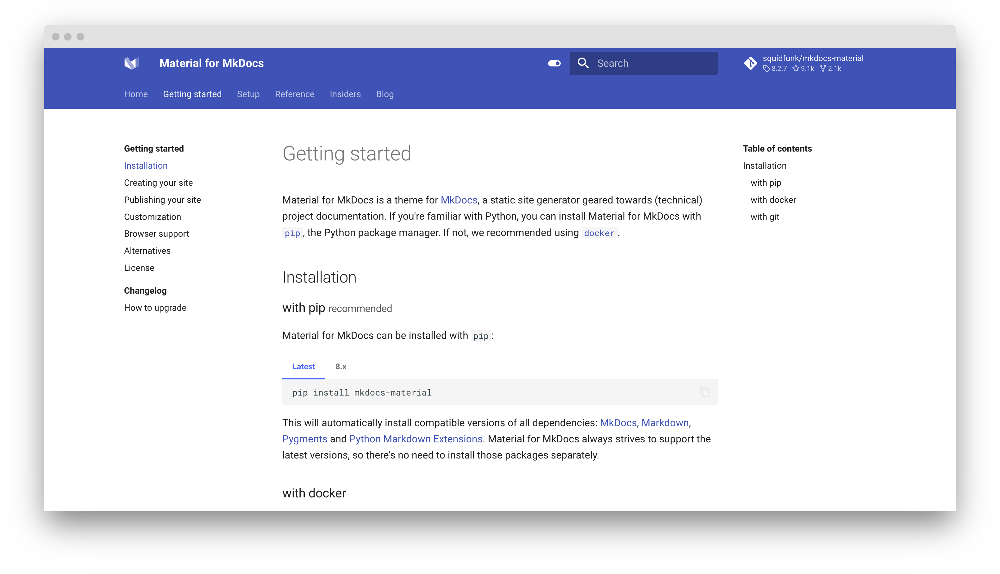

# MkDocs



**MkDocs** es una herramienta estática de documentación escrita en Python que permite generar sitios web bien estructurados y fáciles de navegar a partir de archivos en formato Markdown. Es ampliamente utilizada para documentar proyectos de software, ya que permite organizar la información de manera clara y profesional sin necesidad de conocimientos avanzados en diseño web.  

Gracias a su integración con temas personalizables y su compatibilidad con GitHub Pages, MkDocs es una excelente opción para crear y desplegar documentación de manera rápida y eficiente.

🔹 **Página oficial**: [https://www.mkdocs.org/](https://www.mkdocs.org/)

---

## Instalación

Todos los ficheros relacionados con nuestra instalación de **MkDocs** se alojarán dentro de un directorio ubicado en `~/docker`, a fin de tener organizado nuestro sistema de ficheros.

### Paso 1: Crear la estructura de directorios

Para comenzar, crea la estructura de directorios necesaria en tu sistema:

```bash
$ mkdir -p ~/docker/mkdocs/volume/mkdocs
```

### Paso 2: Crear el archivo `docker-compose.yml`

Luego, crea y edita el archivo `docker-compose.yml` en el directorio correspondiente:

```bash
$ vim ~/docker/mkdocs/docker-compose.yml
```

### Paso 3: Estructura de directorios esperada

Antes de iniciar el contenedor, la estructura del sistema de ficheros debería quedar organizada de la siguiente manera:

```bash
~/docker/mkdocs
├── docker-compose.yml
└── volume
    └── mkdocs
```

---

## Despliegue de `docker-compose.yml`

Para desplegar el contenedor de MkDocs, puedes hacerlo tanto desde **Portainer** como desde la línea de comandos usando Docker Compose. Si optas por la segunda opción, ejecuta el siguiente comando para levantar el contenedor:

```bash
$ docker-compose up -d

# Puedes 'bajar' el contenedor mediante
$ docker-compose down

# Puedes ver la salida de log usando
$ docker logs -f <ID_CONTENEDOR>
```

### Contenido del archivo `docker-compose.yml`

Este es el contenido del archivo `docker-compose.yml` que necesitas para configurar tu contenedor de **MkDocs**:

```yaml
services:

  # ================== MkDocs
  mkdocs:
    container_name: mkdocs
    image: polinux/mkdocs      # Nombre del contenedor
    restart: unless-stopped    # Política de reinicio del contenedor

    environment:
      LIVE_RELOAD_SUPPORT: 'true'
      ADD_MODULES: 'fontawesome-markdown mkdocs-git-revision-date-localized-plugin mkdocs-material'
      FAST_MODE: 'true'
      DOCS_DIRECTORY: '/mkdocs'

    volumes:
      - mkdocs:/mkdocs         # Volumen para la estructura de ficheros y configuración

    ports:
      - "8000:8000"            # Puerto para la interfaz web

volumes:
  mkdocs:
    driver_opts:
      type: none
      device: ~/docker/mkdocs/volume/mkdocs
      o: bind
```

---

## Acceso

Una vez que el contenedor esté desplegado y funcionando, podrás acceder a la interfaz web de **MkDocs** a través de tu navegador. Simplemente ingresa la siguiente URL en la barra de direcciones:

```
http://ip-server:8000
```

Sustituye `ip-server` por la IP de tu dispositivo.