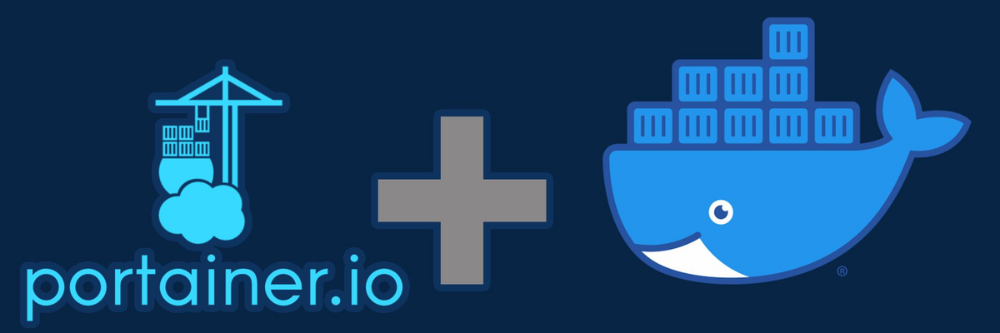

# Portainer



**Portainer** es una interfaz web que facilita la administración de **Docker, Docker Swarm y Kubernetes** sin necesidad de usar comandos en la terminal. Es ideal para gestionar contenedores, imágenes, volúmenes y redes de forma visual e intuitiva.  

### 🎯 **¿Para qué sirve Portainer?**  
✅ **Administra contenedores Docker fácilmente** desde una web.  
✅ **Crea, inicia, detiene y elimina contenedores** con unos clics.  
✅ **Gestiona volúmenes, redes e imágenes** sin usar la terminal.  
✅ **Soporte para múltiples entornos**: Docker local, remoto, Swarm y Kubernetes.  
✅ **Control de usuarios y permisos** en equipos de trabajo.  
✅ **Monitorea recursos** en tiempo real.  
✅ **Compatibilidad con stacks de Docker Compose**.  

🔹 **Página oficial**: [https://www.portainer.io](https://www.portainer.io)

---

## Instalación

Todos los ficheros relacionados con nuestra instalación de **Portainer** se alojarán dentro de un directorio ubicado en `~/docker`, a fin de tener organizado nuestro sistema de ficheros.

### Paso 1: Crear la estructura de directorios

Para comenzar, crea la estructura de directorios necesaria en tu sistema:

```bash
mkdir -p ~/docker/portainer/volume/data
```

### Paso 2: Crear el archivo `docker-compose.yml`

Luego, crea y edita el archivo `docker-compose.yml` en el directorio correspondiente:

```bash
vim ~/docker/portainer/docker-compose.yml
```

### Paso 3: Estructura de directorios esperada

Antes de iniciar el contenedor, la estructura del sistema de ficheros debería quedar organizada de la siguiente manera:

```bash
$ tree ~

~/docker/portainer
├── docker-compose.yml
└── volume
    └── data
```

---

## Despliegue de `docker-compose.yml`

Para desplegar el contenedor de **Portainer**, puedes hacerlo ejecutando el siguiente comando para levantar el contenedor:

```bash
$ docker-compose up -d

# Puedes 'bajar' el contenedor mediante
$ docker-compose down

# Puedes ver la salida de log usando
$ docker logs -f <ID_CONTENEDOR>
```

### Contenido del archivo `docker-compose.yml`

Este es el contenido del archivo `docker-compose.yml` que necesitas para configurar tu contenedor de **Portainer**:

```yaml
services:

  # ================== Portainer
  portainer:
    image: portainer/portainer-ce:latest
    container_name: portainer
    restart: unless-stopped
    
    volumes:
      - /etc/localtime:/etc/localtime:ro
      - /var/run/docker.sock:/var/run/docker.sock:ro
      - data:/data
    
    ports:
      - "8000:8000"
      - "9443:9443"

volumes:
  data:
    driver_opts:
      type: none
      device: ~/docker/portainer/volume/data
      o: bind
```

---

## Acceso

Una vez que el contenedor esté desplegado y funcionando, podrás acceder a la interfaz web de **Portainer** a través de tu navegador. Simplemente ingresa la siguiente URL en la barra de direcciones:

```
http://ip-server:9443
```

Sustituye `ip-server` por la IP de tu dispositivo.