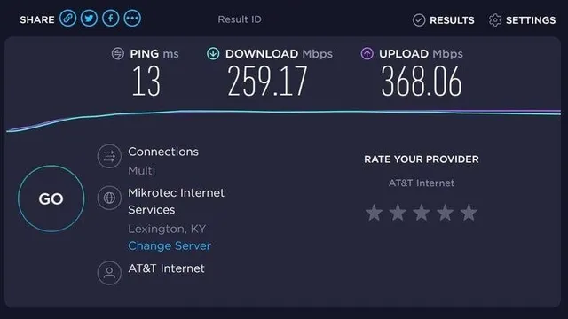

# SpeedTest Tracker




**Speedtest Tracker** es una aplicación autoalojada para el seguimiento del rendimiento de internet que ejecuta pruebas de velocidad utilizando el servicio de Speedtest de Ookla.

- Beneficios de Speedtest Tracker<br>
    Speedtest Tracker permite construir un historial del rendimiento de la conexión a internet, proporcionando información valiosa sobre las velocidades reales en comparación con las velocidades publicitadas por el proveedor de servicios de internet (ISP). Además, ofrece una amplia gama de datos útiles para aquellos interesados en el análisis detallado del rendimiento de su conexión.

- Comparación con otras versiones<br>
    El proyecto original [Speedtest Tracker](https://github.com/henrywhitaker3/Speedtest-Tracker) de Henry Whitaker ha sido abandonado. [Esta versión](https://docs.speedtest-tracker.dev/) es un reemplazo mantenido activamente, con una interfaz de usuario mejorada y un conjunto de características ampliado.

🔹 **Página oficial**: [https://docs.speedtest-tracker.dev](https://docs.speedtest-tracker.dev)

---

## Instalación

Todos los ficheros relacionados con nuestra instalación de **Speedtest Tracker** se alojarán dentro de un directorio ubicado en `~/docker`, a fin de tener organizado nuestro sistema de ficheros.

### Paso 1: Crear la estructura de directorios

Para comenzar, crea la estructura de directorios necesaria en tu sistema:

```bash
mkdir -p ~/docker/speedtest-tracker/volume/data
```

### Paso 2: Crear el archivo `docker-compose.yml`

Luego, crea y edita el archivo `docker-compose.yml` en el directorio correspondiente:

```bash
vim ~/docker/speedtest-tracker/docker-compose.yml
```

### Paso 3: Estructura de directorios esperada

Antes de iniciar el contenedor, la estructura del sistema de ficheros debería quedar organizada de la siguiente manera:

```bash
$ tree ~

~/docker/speedtest-tracker
├── docker-compose.yml
└── volume
    └── data
```

---

## Despliegue de `docker-compose.yml`

Para desplegar el contenedor de **Speedtest Tracker**, puedes hacerlo tanto desde **Portainer** como desde la línea de comandos usando Docker Compose. Si optas por la segunda opción, ejecuta el siguiente comando para levantar el contenedor:

```bash
$ docker-compose up -d

# Puedes 'bajar' el contenedor mediante
$ docker-compose down

# Puedes ver la salida de log usando
$ docker logs -f <ID_CONTENEDOR>
```

### Contenido del archivo `docker-compose.yml`

Este es el contenido del archivo `docker-compose.yml` que necesitas para configurar tu contenedor de **Speedtest Tracker**:

```yaml
services:

  # ================== SpeedTest Tracker
    speedtest-tracker:
        image: linuxserver/speedtest-tracker:latest
        container_name: speedtest-tracker
        restart: unless-stopped

        environment:
            - PUID=1000
            - PGID=1000
            - DB_CONNECTION=sqlite
            - APP_KEY=base64:JwidBPN+jiSoy8ijbDtBvLHliWh38l8Dwzz8bfdagFw=
            - TZ=Europe/Madrid                  # Zona horaria
            - APP_TIMEZONE=Europe/Madrid        # Zona horaria

            - SPEEDTEST_SCHEDULE=*/15 * * * *   # El test se ejecutará cada 15 minutos
            # - SPEEDTEST_SERVERS=
            # - PRUNE_RESULTS_OLDER_THAN=
            # - CHART_DATETIME_FORMAT= 
            # - DATETIME_FORMAT=
            # - TELEGRAM_BOT_TOKEN=

        volumes:
            - data:/config
        
        ports:
            - 8003:80
            - 9444:443
    
volumes:
  data: 
    driver_opts:
      type: none
      device: ~/docker/speedtest-tracker/volume/data
      o: bind
```

Ejemplos para configurar la variable de entorno `SPEEDTEST_SCHEDULE`
```bash
| Cron expression | Schedule                           |
|-----------------|------------------------------------|
| * * * * *       | Every minute                       |
| */5 * * * *     | Every 5 minute                     |
| 0 * * * *       | Every hour                         |
| 0 0 * * *       | Every day at 12:00 AM              |
| 0 0 * * FRI     | At 12:00 AM, only on Friday        |
| 0 0 1 * *       | At 12:00 AM, on day 1 of the month |
```

---

## Acceso

Una vez que el contenedor esté desplegado y funcionando, podrás acceder a la interfaz web de **Speedtest Tracker** a través de tu navegador. Simplemente ingresa la siguiente URL en la barra de direcciones:

```
http://ip-server:9080
```

Sustituye `ip-server` por la IP de tu dispositivo.

---

# Configuración Inicial
En el siguiente enlace tienes el acceso a la documentación oficial: [https://docs.speedtest-tracker.dev/security/authentication](https://docs.speedtest-tracker.dev/security/authentication)

1. Entrar por primera vez, usar las credenciales iniciales:
    | Username          | Password |
    |-------------------|----------|
    | admin@example.com | password |

2. Cambiar estar credenciales en tras el primer inicio en el apartado `USER`.