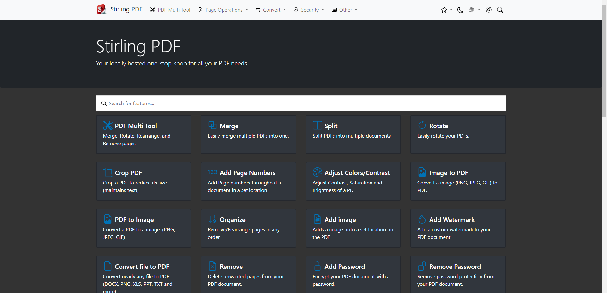

# Stirling-PDF



Stirling-PDF es una herramienta web de código abierto que permite manipular archivos PDF de manera eficiente y segura. Funciona como una aplicación web alojada localmente, lo que garantiza que tus documentos no salgan de tu red y que tu información permanezca privada.

**Características principales de Stirling-PDF:**

- **Funciones de manipulación de PDF:** Ofrece herramientas para dividir, fusionar, convertir, reorganizar, agregar imágenes, rotar, comprimir y más.

- **Interfaz de usuario interactiva:** Proporciona una GUI completa para gestionar archivos PDF, permitiendo combinar varios documentos en uno solo, dividir archivos en partes específicas, reorganizar páginas y eliminar páginas no deseadas. 

- **Seguridad y privacidad:** Al ser una aplicación alojada localmente, no almacena ni envía tus archivos a servidores externos, asegurando que tus documentos permanezcan confidenciales.

- **Personalización:** Permite ajustar la interfaz, el nombre de la aplicación y la descripción según tus preferencias, brindando una experiencia personalizada.

- **Funciones adicionales:** Incluye herramientas como la conversión de PDF a imagen, firma de documentos, detección y eliminación de páginas en blanco, comparación de documentos y más.

Stirling-PDF está diseñado para ser utilizado en entornos locales, sin necesidad de conexión a internet, y es compatible con Docker para facilitar su instalación y despliegue.

🔹 **Página oficial**: [https://github.com/Stirling-Tools/Stirling-PDF](https://github.com/Stirling-Tools/Stirling-PDF)

---

## Instalación

Todos los ficheros relacionados con nuestra instalación de **Stirling-PDF** se alojarán dentro de un directorio ubicado en `~/docker`, a fin de tener organizado nuestro sistema de ficheros.

### Paso 1: Crear la estructura de directorios

Para comenzar, crea la estructura de directorios necesaria en tu sistema:

```bash
mkdir -p ~/docker/stirlingpdf/volume/{tessdata,configs}
```

### Paso 2: Crear el archivo `docker-compose.yml`

Luego, crea y edita el archivo `docker-compose.yml` en el directorio correspondiente:

```bash
vim ~/docker/stirlingpdf/docker-compose.yml
```

### Paso 3: Estructura de directorios esperada

Antes de iniciar el contenedor, la estructura del sistema de ficheros debería quedar organizada de la siguiente manera:

```bash
$ tree ~

~/docker/stirlingpdf
├── docker-compose.yml
└── volume
    ├── tessdata
    └── configs
```

---

## Despliegue de `docker-compose.yml`

Para desplegar el contenedor de **Stirling-PDF**, puedes hacerlo tanto desde **Portainer** como desde la línea de comandos usando Docker Compose. Si optas por la segunda opción, ejecuta el siguiente comando para levantar el contenedor:

```bash
$ docker-compose up -d

# Puedes 'bajar' el contenedor mediante
$ docker-compose down

# Puedes ver la salida de log usando
$ docker logs -f <ID_CONTENEDOR>
```

### Contenido del archivo `docker-compose.yml`

Este es el contenido del archivo `docker-compose.yml` que necesitas para configurar tu contenedor de **Stirling-PDF**:

```yaml
services:

  #================== stirling-pdf
  stirling-pdf:
    image: frooodle/s-pdf:latest
    container_name: stirlingpdf
    restart: unless-stopped

    environment:
      - DOCKER_ENABLE_SECURITY=false
      - INSTALL_BOOK_AND_ADVANCED_HTML_OPS=false
      - LANGS=es_ES

    volumes:
      - ./trainingData:/usr/share/tessdata #Required for extra OCR languages
      - ./extraConfigs:/configs
#      - ./customFiles:/customFiles/
#      - ./logs:/logs/

    ports:
      - '8086:8080'

# Definición de volúmenes
volumes:
  tessdata:
    driver_opts:
      type: none
      device: ~/docker/stirlingpdf/volume/tessdata
      o: bind

  configs:
    driver_opts:
      type: none
      device: ~/docker/stirlingpdf/volume/configs
      o: bind
```

---

## Acceso

Una vez que el contenedor esté desplegado y funcionando, podrás acceder a la interfaz web de **Stirling-PDF** a través de tu navegador. Simplemente ingresa la siguiente URL en la barra de direcciones:

```
http://ip-server:8086
```

Sustituye `ip-server` por la IP de tu dispositivo.