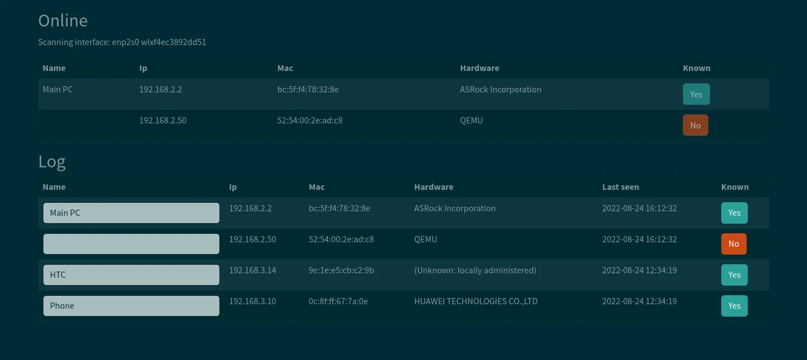

# WatchYourLAN



**WatchYourLAN** es una herramienta ligera de escaneo de IPs en red que permite monitorear en tiempo real los dispositivos conectados a tu red local. Proporciona información detallada sobre el estado y la actividad de cada dispositivo, ayudándote a mantener un control sobre tu red.

**Características principales de WatchYourLAN:**

- **Detección de dispositivos:** Identifica y muestra todos los dispositivos conectados a tu red local, proporcionando información sobre su dirección IP y MAC. 

- **Notificaciones de nuevos dispositivos:** Envía alertas cuando se detecta un nuevo dispositivo en la red, permitiéndote estar al tanto de cualquier conexión no autorizada.

- **Historial de actividad:** Monitorea y registra el estado en línea y fuera de línea de cada dispositivo, ofreciendo un historial detallado de su actividad en la red. 

- **Integración con bases de datos:** Ofrece la opción de exportar datos a InfluxDB2, facilitando la creación de paneles de control personalizados en Grafana para una visualización más detallada.

- **Interfaz web intuitiva:** Proporciona una interfaz gráfica de usuario accesible a través de un navegador web, simplificando la configuración y el uso de la herramienta.

**Consideraciones de seguridad:**

Es importante destacar que WatchYourLAN requiere operar en modo de red "host", lo que implica que el puerto de la aplicación estará expuesto. Se recomienda tomar medidas adicionales, como configurar un firewall, para limitar el acceso no autorizado a la herramienta.

🔹 **Página oficial**: [https://github.com/aceberg/WatchYourLAN](https://github.com/aceberg/WatchYourLAN)

---

## Instalación

Todos los ficheros relacionados con nuestra instalación de **WatchYourLAN** se alojarán dentro de un directorio ubicado en `~/docker`, a fin de tener organizado nuestro sistema de ficheros.

### Paso 1: Crear la estructura de directorios

Para comenzar, crea la estructura de directorios necesaria en tu sistema:

```bash
mkdir -p ~/docker/watchyourlan/volume/data
```

### Paso 2: Crear el archivo `docker-compose.yml`

Luego, crea y edita el archivo `docker-compose.yml` en el directorio correspondiente:

```bash
vim ~/docker/watchyourlan/docker-compose.yml
```

### Paso 3: Estructura de directorios esperada

Antes de iniciar el contenedor, la estructura del sistema de ficheros debería quedar organizada de la siguiente manera:

```bash
$ tree ~

~/docker/watchyourlan
├── docker-compose.yml
└── volume
    └── data
```

---

## Despliegue de `docker-compose.yml`

Para desplegar el contenedor de **WatchYourLAN**, puedes hacerlo tanto desde **Portainer** como desde la línea de comandos usando Docker Compose. Si optas por la segunda opción, ejecuta el siguiente comando para levantar el contenedor:

```bash
$ docker-compose up -d

# Puedes 'bajar' el contenedor mediante
$ docker-compose down

# Puedes ver la salida de log usando
$ docker logs -f <ID_CONTENEDOR>
```

### Contenido del archivo `docker-compose.yml`

Este es el contenido del archivo `docker-compose.yml` que necesitas para configurar tu contenedor de **WatchYourLAN**:

```yaml
services:

  #================== watch your lan
  watchyourlan:
    image: aceberg/watchyourlan:latest
    container_name: watchyourlan
    restart: unless-stopped

    environment:
      TZ: Europe/Madrid                 # Zona horaria
      IFACE: "eth0"                     # required: 1 or more interface !!! OJO poner la del equipo donde se monta el contenedor
      DBPATH: "/data/db.sqlite"         # optional, default: /data/db.sqlite
      GUIPORT: "8004"                   # optional, default: 8840
      TIMEOUT: "120"                    # optional, time in seconds, default: 60

    volumes:
    - data:/data

    network_mode: "host"  

# Definición de volúmenes
volumes:
  data:
    driver_opts:
      type: none
      device: ~/docker/watchyourlan/volume/data
      o: bind
```

---

## Acceso

Una vez que el contenedor esté desplegado y funcionando, podrás acceder a la interfaz web de **WatchYourLAN** a través de tu navegador. Simplemente ingresa la siguiente URL en la barra de direcciones:

```
http://ip-server:8004
```

Sustituye `ip-server` por la IP de tu dispositivo.